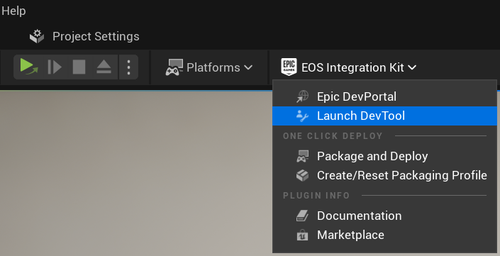
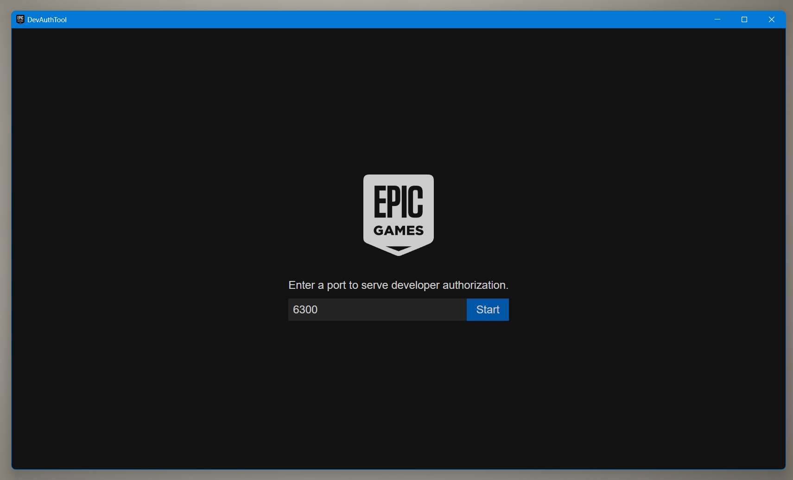
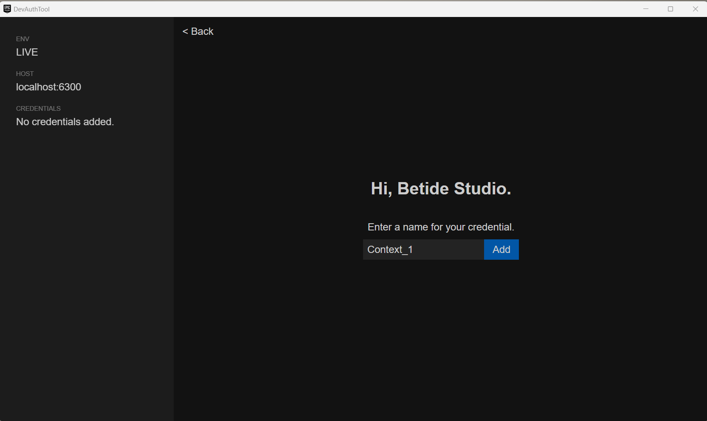

# Autologin

Starting from version 4 of the plugin, you can use the autologin feature to automatically log in users when the game/editor standalone is launched. This feature is useful for games that don't require the user to log in every time they launch the game.

Autologin is disabled by default. To enable it, you need to set the `Auto Login` option in the plugin settings to a value other then `None`.

## How it works

When the game/editor standalone is launched, the plugin will automatically try to log in the user using the specified method. If the login fails using the specified method, the user will be prompted to log in using the fallback method.

You can also configure if you want to use EAS or not for autologin. If you don't want to use EAS, you can set the `Use EAS` option in the plugin settings to `false`. But remember, make sure the method you are using for autologin doesn't require EAS.

## Developer Tool Autologin

If the `Auto Login Type` is set to `Developer Tool`, the plugin will automatically log in the user using the developer tool. This is useful for testing purposes.

**BUT** there is one more great feature added to the flow, you can add multiple contexts to the Developer Tool, and the plugin will automatically log in multiple standalones with different users.

1. You can launch the DevTool from the toolbar : 
{" "}

 
2. Use port 6300 that is used by default or if you want to change it, make sure to change it in the plugin settings as well.
{" "}

 
3. Add the context and the user you want to log in with.
{" "}
  
 
**Make sure to name the context as Context_1, Context_2 etc**

4. Launch the standalone and the plugin will automatically log in with the user you have added in the context.

### Note

- Developer Tool Autologin is only available in the editor standalone.