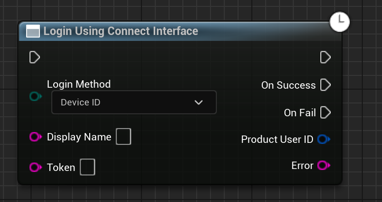

import { Callout } from 'nextra/components'

# Basics of Authentication

<Callout type="info">
    Please note that using EAS doesn't necessarily mean that you have to use Epic's Website to login, you may use thirdparty tokens and stuff but your account MUST be linked to an Epic Account or else, you will have to link it on the first run.
</Callout>

There are majorly two types of authentication types/flows that are supported by the EOS SDK.

1. [**Connect Interface**](https://dev.epicgames.com/docs/game-services/eos-connect-interface): This is the most basic and easist way to authenticate your users and would be the most common way to authenticate your users. This method is used when you want to authenticate your users `without using Epic Account Services`.

    The most used methods availble for the users under this interface are:
    - **DeviceId**
    - **Oculus**
    - **Steam**
    - **Google**
    - **Apple**
    - **OpenID**
    - **Discord** etc

<Callout type="warning">
    As this method does not use Epic Account Services, the user will not be able to use some features like Overlay, Invites etc.
</Callout>

The node to authenticate the user using the `Connect Interface` is `Login using Connect Interface`:
    
    

  

2. [**Auth Interface**](https://dev.epicgames.com/docs/epic-account-services/auth/auth-interface): This is the most advanced way to authenticate your users and would be used when you want to authenticate your users `using Epic Account Services`.

    The most used methods availble for the users under this interface are:
    - **Persistent Auth**
    - **Account Portal**
    - **Developer Tool**
    - **Epic Games Launcher(Exchange Code)**
    - **Epic Games Email and Password**
    - **External Auth Methods like Steam**

If the user is logging in for the first time with steam, and no epic account is attached, then the user will be prompted to link their account to an Epic Account. This will be a one time process and the user will not be prompted again.