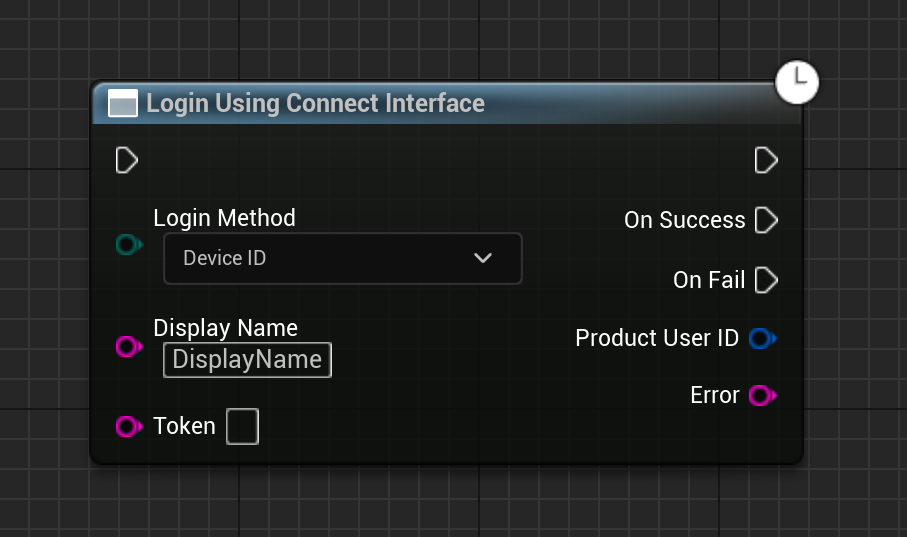

import { Callout } from 'nextra/components'

# Authentication with Device ID

Device ID authentication is a simple method of authentication where the user is authenticated using the device ID. This method is useful when you want to authenticate the user without requiring them to log in. This method is useful for single-player games or games where you don't need to store user data on the server.

## Implementation

The implementation of the Device ID authentication method is quite simple. Here is an example of how you can do this:

<Callout type="warning">
    Display Name should not be empty. 
</Callout>

### Blueprint Implementation

  

### C++ Implementation


#### Build.cs

```c#
PrivateDependencyModuleNames.AddRange(new string[] { "OnlineSubsystem", "OnlineSubsystemUtils" });
```

#### Header File

```cpp
#include "OnlineSubsystem.h"
#include "OnlineSubsystemUtils.h"
#include "Interfaces/OnlineIdentityInterface.h"

/**
 * 
 */

public:
	// This function is used to login using the Device ID
	void LoginWithDeviceID();
	void LoginWithDeviceIDCallback(int32 LocalUserNum, bool bWasSuccess, const FUniqueNetId& UserId, const FString& Error);
```

#### Source File

```cpp
void UMyGameInstanceSubsystem::LoginWithDeviceID()
{
	if(const IOnlineSubsystem *SubsystemRef = Online::GetSubsystem(GetWorld()))
	{
		if(const IOnlineIdentityPtr IdentityPointerRef = SubsystemRef->GetIdentityInterface())
		{
			FOnlineAccountCredentials AccountDetails;
			AccountDetails.Type = "noeas_+_EIK_ECT_DEVICEID_ACCESS_TOKEN";
			AccountDetails.Id = "playerdisplayname";
			IdentityPointerRef->OnLoginCompleteDelegates->AddUObject(this,&UMyGameInstanceSubsystem::LoginWithDeviceIDCallback);
			IdentityPointerRef->Login(0,AccountDetails);
		}
	}
}

void UMyGameInstanceSubsystem::LoginWithDeviceIDCallback(int32 LocalUserNum, bool bWasSuccess,
	const FUniqueNetId& UserId, const FString& Error)
{
	if(bWasSuccess)
	{
		UE_LOG(LogTemp, Warning, TEXT("LoginWithDeviceIDCallback: Login was successful. UserID: %s"), *UserId.ToString());
	}
	else
	{
		UE_LOG(LogTemp, Error, TEXT("LoginWithDeviceIDCallback: Login was not successful. Error: %s"), *Error);
	}
}
```
