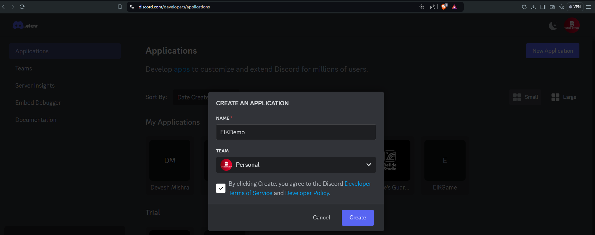
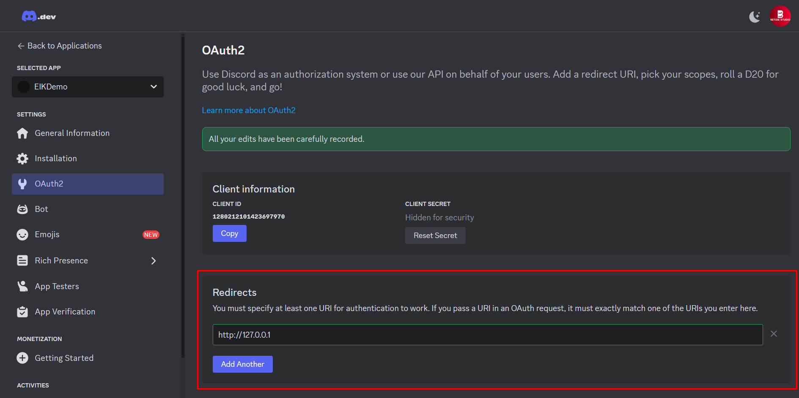
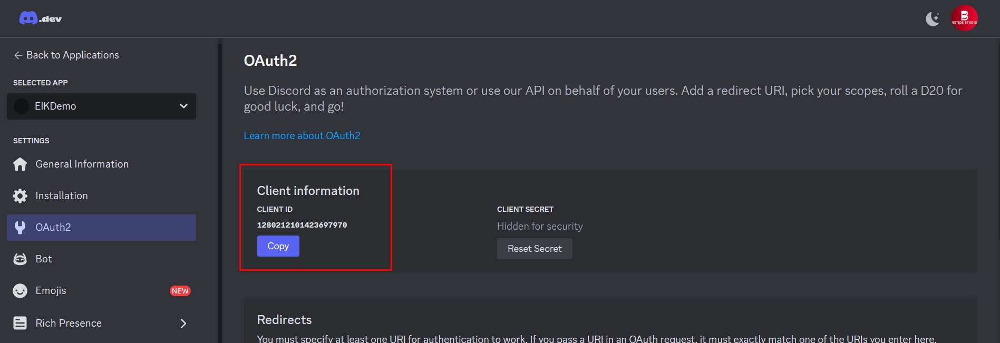
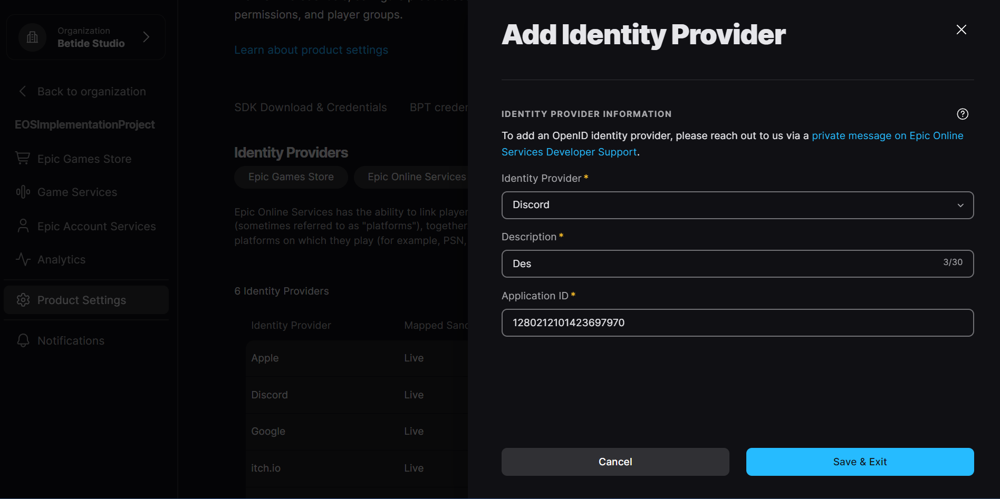
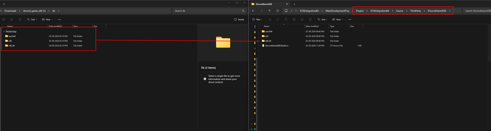
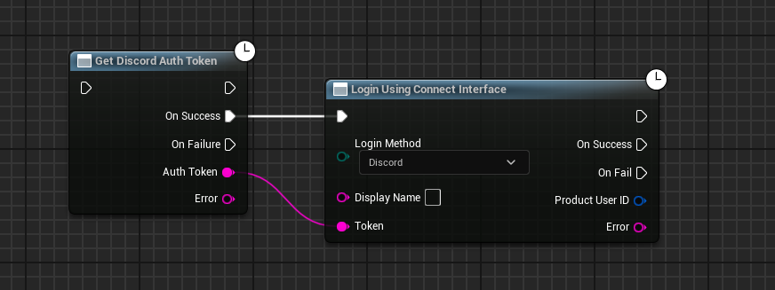

import { Callout } from 'nextra/components'

# Authentication with Discord

Starting from version 4.2.5, the Discord login method is fully supported by the plugin. This means that you can now authenticate your users using their Discord account.

<Callout type="info">
    Credits where it's due: The code majorly comes from the [XistGG's Discord Game Sample](https://github.com/XistGG/DiscordGameSample) sample project.
</Callout>

## Web Settings

### Setting up Discord App

Before you can start using the Discord login method, you need to create a Discord application. To do this, follow these steps:

1. Go to the [Discord Developer Portal](https://discord.com/developers/applications).

2. Click on the **New Application** button in the top right corner and fill in the Name and select the Team and click on the **Create** button.

  

3. Click on the **OAuth2** tab in the left sidebar and click on the **Add Redirect** button and add the redirect URL which for us at the moment is `http://127.0.0.1`. 

  

4. On the same page(or on the **General Information** tab), copy the **Client ID**. You will need this later.

  

That is all you need to do on the Discord Developer Portal. Now let's move on to Epic Devportal.

### Setting up Epic Devportal

1. Go to the [Epic Devportal](https://dev.epicgames.com/portal/en-US/).

2. Now select the product you want to add the Discord login method to and then go to it's **Product Settings** page.

3. Click on the **Identity Providers** tab and then click on the **Add Identity Provider** button.

4. Select **Discord** from the dropdown and then fill in the **Client ID** and a **Description** of your choice and click on the **Save** button.

  

5. To attach the Identity Provider to your sandbox, go to **Sandboxes** and select the sandbox you want to attach the Identity Provider to. Now click on **Identity Providers** and select the profile you just created. Press **Save** and you are done!

This will take a few minutes to get it to populate, give it a few minutes and you are ready to go!

## Unreal Settings

### Configuring Config

In the `DefaultGame.ini` file, you need to add the following lines:

```ini
[/Script/DiscordGame.DiscordGameSubsystem]
ClientId={Your Client ID}
```

<Callout type="warning">
    Make sure to add the plugin to your project by adding it to your project's Plugin folder.
</Callout>

### Minimal Hardwork

So, few things you need to do to get the Discord login method working in your project:

1. Add the `Discord SDK Library` to your project. You can download the [Discord v3.2.1](https://discord.com/developers/docs/developer-tools/game-sdk) from the Discord Developer Portal and after unzipping, copy the contents of the lib folder to `Plugins\EOSIntegrationKit\Source\ThirdParty\DiscordGameSDK` like this:

  

2. Unzip the `discord-cpp.zip` folder present in the `Plugins\EOSIntegrationKit\Source\DiscordGame` folder.

### Blueprint Implementation

Now the final step is to implement the Discord login method in your project. Here is an example of how you can do this:

  

That is it! You have successfully implemented the Discord login method in your Unreal Engine project. Now you can authenticate your users using their Discord account.