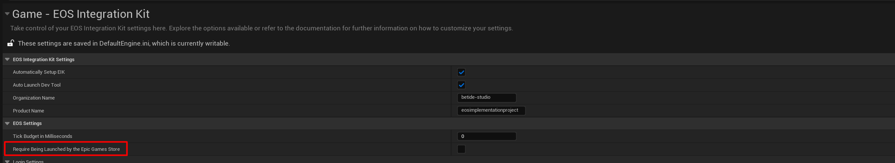

# Authentication with Epic Games Store

When the game is launched from the Epic Games Store, the command line argument contains the credentials of the user. The game can use these credentials to automatically log in the user. 

No additional setup is required to use this feature.

## Important Notes

- If you have any auto-login type set in the plugin settings, it will be overriden by the Epic Games Store credentials, which is given higher priority.
- If you want that the game is only playable when launched from the Epic Games Store, you can set the following setting to true in the plugin settings:

  

  