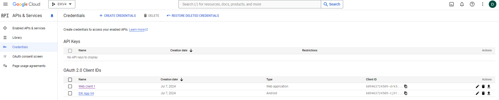
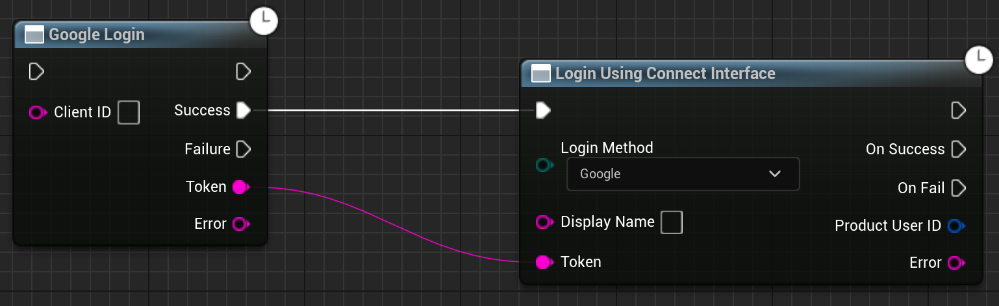

# Authentication with Google on Android

Okay Android developers, let's get you set up with Google authentication in your game. I will suggest you to grab a cup of coffee, as this is going to be a long one, but don't worry, I will guide you through the process step by step.

## Prerequisites and important notes

- You will need a SHA-1 key for your app and a keystore file. If you don't have one, you can generate one, you can follow the steps [here](https://youtu.be/brUsx5xfXdY).
- Be patient, as this process can be a bit tricky and time-consuming. If you mess up somewhere, you will almost certainly have to start over as debugging this can be a nightmare.
- If after following this guide you are still facing issues, you will have to start debugging the issue by firstly enabling the logs. Check [here](/extendedlogging) for more information on how to enable logs in shipping builds.
- If the above logs don't help, connect your device to your computer and check the logs using `adb logcat` to see what is going wrong.

## Setting up Google Developer Console

1. Go to the [Google Developer Console](https://console.cloud.google.com/) and create a new project if you don't have one already.

2. On the OAuth consent screen page, make sure all of the information is complete and accurate. In particular, make sure you have specified the URLs of your app's privacy policy and terms of service.

3. On the Credentials page, create an Android client ID for your app if you don't already have one. You will need to specify your app's package name and SHA-1 signature.
        
        a. Go to the Credentials page.

        b. Click **Create credentials** > **OAuth client ID.**

        c. Select the **Android** application type.

4. On the Credentials page, create a web application client ID if you don't already have one. You can leave the Authorized JavaScript Origins and Authorized redirect URIs fields blank. This client ID represents your authentication backend server. (You would use this client ID when calling Google APIs from your server, but you need it even if you don't.)
        
        a. Go to the Credentials page.

        b. Click **Create credentials** > **OAuth client ID.**

        c. Select the **Web** application application type.

The final product should look something like this:

          

## Setting up your Unreal Engine project

1. Go to your Unreal Engine project directory and create a new folder called `Android` under the `Build` folder, if you don't have one already.

2. Copy your keystore file to the `Android` folder.

3. Open your project in Unreal Engine and go to `Edit` > `Project Settings` > `Platforms` > `Android`. Under the `Distribution Signing` section, fill in the fields with the information from your keystore file.

4. On the same page, set the **Android Package Name** to the package name of your app that you used when creating the client ID on the Google Developer Console.

5. Now, under **Project Settings** > **Project** > **Packaging**, set **For Distribution** to true and build configuration to **Shipping**.

### Code Setup

For your login button, you will need to call the `GoogleSignIn` node. Here is an example of how you can set it up:

  

In the client ID field, you will need to enter the client ID you created on the Google Developer Console. It should be the **WEB APPLICATION** client ID.

## Setting up Epic DevPortal

1. Go to the [Epic Games Developer Portal](https://dev.epicgames.com/portal/en-US/home) and select your project.
2. Now under **Product Settings**, click on **Identity Providers** and press on **Add Identity Provider**.
3. Select **Google** from the list and fill in the **Client Id** that is generated from the Google Developer Console. It has to be the **WEB APPLICATION** client ID. **Description** can be anything you want.
4. To attach the Identity Provider to your sandbox, go to **Sandboxes** and select the sandbox you want to attach the Identity Provider to. Now click on **Identity Providers** and select the profile you just created. Press **Save** and you are done!

This will take a few minutes to get it to populate, give it a few minutes and you are ready to go!

## Testing the login

Now that you have set up the Google Developer Console, Unreal Engine project, and Epic DevPortal, you can test the Google login method in your project. Make sure you are building the project for Android and testing it on an Android device.

That is it! You have successfully implemented the Google login method in your Unreal Engine project. Now you can authenticate your users using their Google account.