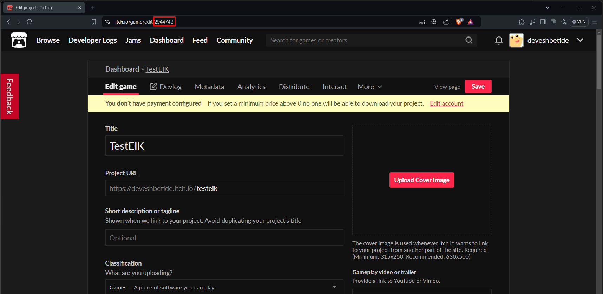
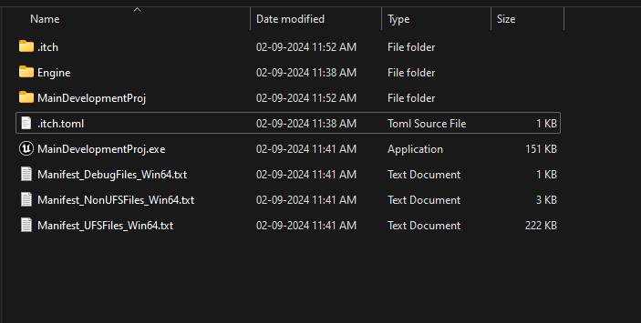
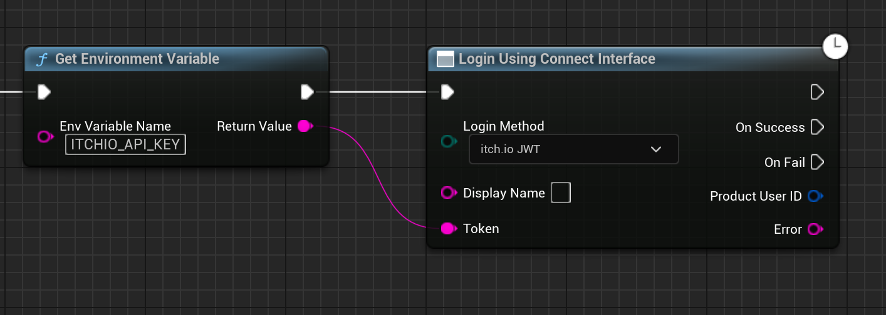

# Authentication with Itch.io

Starting from version 4.2.2, the Itch.io login method is fully supported by the plugin. This means that you can now authenticate your users using their Itch.io account.

Before you can start using the Itch.io login method, you need to create an Itch.io application. You can learn more about creating an application on the [Itch.io Documentation](https://itch.io/docs/creators/getting-started).

## Connecting Itch.io with Epic Games

1. Go to the [Epic Games Developer Portal](https://dev.epicgames.com/portal/en-US/home) and select your project.

2. Now under **Product Settings**, click on **Identity Providers** and press on **Add Identity Provider**.

3. Select **Itch.io** from the list and fill in any **Description** as per your choice and then the **App ID** that you got from the Itch.io Developer Dashboard. This is usually present in the URL for the edit page of your itch.io game.

  

4. To attach the Identity Provider to your sandbox, go to **Sandboxes** and select the sandbox you want to attach the Identity Provider to. Now click on **Identity Providers** and select the profile you just created. Press **Save** and you are done!

This will take a few minutes to get it to populate, give it a few minutes and you are ready to go!

## Configuring Config

In the `.itch.toml` file, you need to add the following lines:

```toml
[[actions]]
name = "TestEIK"
path = "MainDevelopmentProj.exe"
scope = "profile:me"
```

If you don't have a `.itch.toml` file, you can create one in the root of your project, like this:

  

## Blueprint Implementation

Now the final step is to implement the Itch.io login method in your project. Here is an example of how you can do this:

You need to get the ApiKey from Environment Variable `ITCHIO_API_KEY` and then call the `Login using Connect Interface` method with the `Itch.io JWT` method.

  

That is it! You have successfully implemented the Itch.io login method in your Unreal Engine project. Now you can authenticate your users using their Itch.io account.

Make sure to build and upload your game to Itch.io and test the login method by launching the game from the Itch.io app.