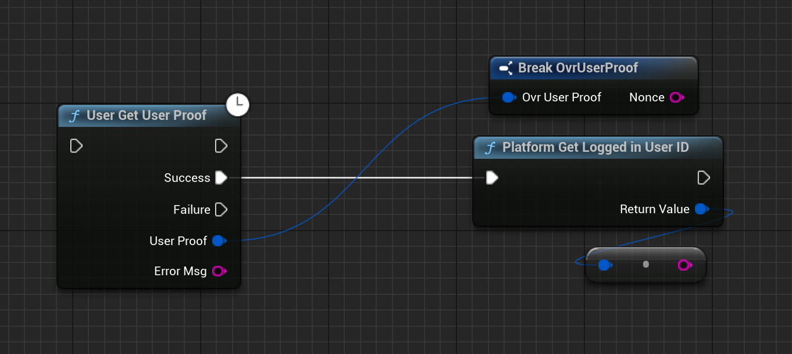

# Authentication with Oculus

Starting from version 4.0.0, the Oculus login method is fully supported by the plugin. This means that you can now authenticate your users using their Oculus account.

## Setting up Oculus App

Before you can start using the Oculus login method, you need to create an Oculus application. To do this, follow these steps:

1. Go to the [Oculus Developer Dashboard](https://developer.oculus.com/manage/).
2. If you don't have a Oculus App yet, create a new one by clicking on the **Create New App** button in the top right corner and fill in the required information.
3. Now on the left side, click on **Requirements** and then **Data Use Checkup**. Two things we need majorly are:
   - **User Id**: This is required to get the unique id of the user.
   - **User Profile**: This is required to get the user's profile informatio like username and user proof.
    
    You may need to apply for these permissions and get them approved by Oculus, but it's almost instant. (Atleast in our case, it takes 5-6 minutes)

4. Once you have the permissions, get the **App ID** and **App Secret** from the **API** page.

## Setting up MetaXrPlatform plugin

1. Go to [Oculus - Unreal Engine 5 Platform SDK](https://developer.oculus.com/downloads/package/unreal-5-platform-sdk-plugin/) and download the MetaXrPlatform plugin.
2. After downloading, extract the plugin to the **Plugins** folder in your Unreal Engine project. [You may need to build the project through Visual Studio to get the plugin working]
3. After the plugin is successfully added, go to **DefaultEngine.ini** and add the following lines:

```ini
[OnlineSubsystemOculus]
bEnabled=true
MobileAppId={Your App ID}
```

## EOS Setup

This is the easist part :) 

1. Go to the [Epic Games Developer Portal](https://dev.epicgames.com/portal/en-US/home) and select your project.
2. Now under **Product Settings**, click on **Identity Providers** and press on **Add Identity Provider**.
3. Select **Oculus** from the list and fill in the **App ID** and **App Secret** you got from the Oculus Developer Dashboard. For the rest of the settings, you can select the **Environment** as **Quest** and the **Description** as per your choice.
4. To attach the Identity Provider to your sandbox, go to **Sandboxes** and select the sandbox you want to attach the Identity Provider to. Now click on **Identity Providers** and select the profile you just created. Press **Save** and you are done!

This will take a few minutes to get it to populate, give it a few minutes and you are ready to go!

## Blueprint Implementation

Now that you have set up the Oculus App and the MetaXrPlatform plugin, you can start implementing the Oculus login method in your project. Here is an example of how you can do this:

1. Start the Message Pump in your game instance (suggested). This is very important as this starts the delegates to be fired when the proof is generated. If you are not getting any response, this might be the reason.


2. Before calling the login method, you need to check if the user is already logged in. You can do this by calling the `GetLoggedInUserId` method. If the user is logged into Oculus, the method will return the user's ID. If the user is not logged in, the method will return 0.



3. Now it's time to login the user into EOS if the user is ready with the Oculus login. 

<iframe src="https://blueprintue.com/render/lvze45kj/" scrolling="no" allowfullscreen width="100%" height="400px"></iframe>
Cannot view the code? [Click here](https://blueprintue.com/render/lvze45kj/)

That is it! You have successfully implemented the Oculus login method in your Unreal Engine project. Now you can authenticate your users using their Oculus account.

## Important Notes and Tips

- The login will only work when the build is uploaded through the Oculus Store, even if it's Dev or Alpha Stage. The login will not work if you are deploying it on your device directly.