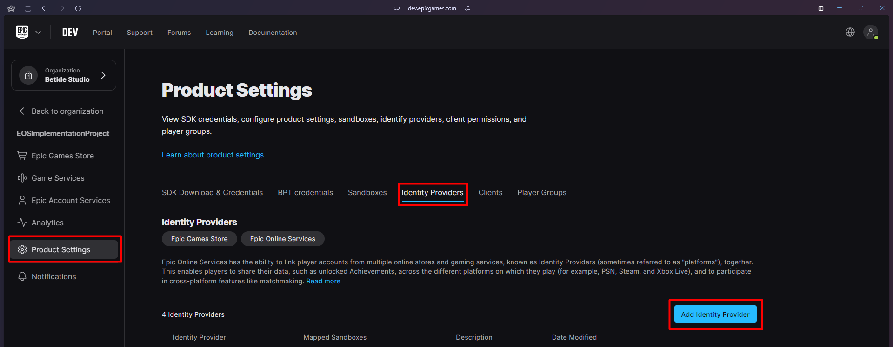
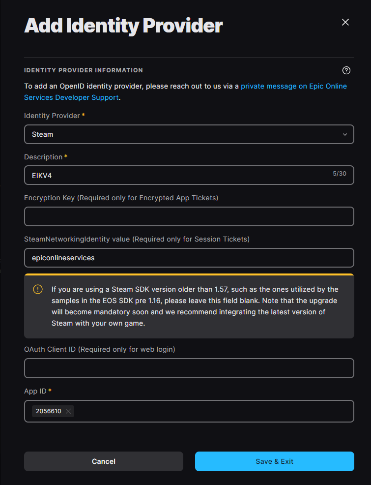

import { Callout } from 'nextra/components'

# Authentication with Steam

<Callout type="warning">
     Steam authentication with app id `480` is no more supported by the EOS SDK now. Make sure you have your own Steam App Id for the authentication to work.
</Callout>


Starting from version 4.0.0, the Steam login method is pretty smooth and easy to implement. Let's dive into the steps to set up the Steam login method in your Unreal Engine project.

## Setting up Epic Developer Portal

1. Go to the [Epic Games Developer Portal](https://dev.epicgames.com/portal/en-US/) and select your project.
{" "}

2. Now under **Product Settings**, click on **Identity Providers** and press on **Add Identity Provider**.
{" "}
 
<br/><br/>

3. Select **Steam** from the list and fill the required information:

   - **Description**: This can be any Description you want to give to the Identity Provider.
   - **Encryption Key**: This should be a empty string.
   - **SteamNetworkingIdentity value**: This should be set to `epiconlineservices` if you are using Unreal Engine 5.4 or above. For Unreal Engine 5.3 or below, this should be a empty string. If you are using [Steam Integration Kit](https://www.unrealengine.com/marketplace/en-US/product/steam-integration-kit), then this should always be set to `epiconlineservices`.
   - **OAuth Client ID**: This should be a empty string.
   - **App ID**: This should be your Steam App ID. If you don't have a Steam App ID, you can get it from the [Steamworks](https://partner.steamgames.com/) website.

  
<br/><br/>

4. To attach the Identity Provider to your sandbox, go to **Sandboxes** and select the sandbox you want to attach the Identity Provider to. Now click on **Identity Providers** and select the profile you just created. Press **Save** and you are done!

This will take a few minutes to get it to populate, give it a few minutes and you are ready to go!

## Project Setup

1. Enable the Steam Plugin that you want to use in your project. You can do this by going to **Edit** -> **Plugins** and search for **Online Subsystem Steam** or **Steam Integration Kit** and enable it.

2. If you are using the **Steam Integration Kit**, just configure the plugin with your Steam App ID and you are good to go. If you are using the **Online Subsystem Steam**, you need to add the following lines to your **DefaultEngine.ini**:

```ini
[OnlineSubsystem]
DefaultPlatformService=EIK
NativePlatformService=Steam

[OnlineSubsystemSteam]
bEnabled=true
SteamDevAppId=[Your Steam ID]
```

## Code Implementation

### Blueprint Implementation

Onto the final step! Now that you have set up the Steam login method in the Epic Developer Portal and your Unreal Engine project, you can start implementing the Steam login method in your project. Here is an example of how you can do this:

<br/><br/>
<iframe src="https://blueprintue.com/render/0c7wrbl8/" scrolling="no" allowfullscreen width="100%" height="400px" border="0"></iframe>
Cannot view the code? [Click here](https://blueprintue.com/render/0c7wrbl8/)

That is it! You have successfully implemented the Steam login method in your Unreal Engine project. Now you can authenticate your users using their Steam account.

### C++ Implementation

#### Build.cs File

Add the following lines to your `Build.cs` file:

```c#
PrivateDependencyModuleNames.AddRange(new string[] { "OnlineSubsystem", "OnlineSubsystemUtils", "OnlineSubsystemEIK" });
```

#### Header File

```cpp
#include "OnlineSubsystem.h"
#include "OnlineSubsystemUtils.h"
#include "Interfaces/OnlineIdentityInterface.h"

/**
 * 
 */

public:
	// This function is used to login using the Steam
	void LoginWithSteam();
	void LoginWithSteamCallback(int32 LocalUserNum, bool bWasSuccess, const FUniqueNetId& UserId, const FString& Error);
```

#### Source File

```cpp
void UMyGameInstanceSubsystem::LoginWithSteam()
{
	if(IOnlineSubsystem* SteamOnlineSub = Online::GetSubsystem(GetWorld(), STEAM_SUBSYSTEM))
	{
		if(IOnlineIdentityPtr SteamIdentityInterface = SteamOnlineSub->GetIdentityInterface())
		{
			IOnlineIdentity::FOnGetLinkedAccountAuthTokenCompleteDelegate Delegate = IOnlineIdentity::FOnGetLinkedAccountAuthTokenCompleteDelegate::CreateLambda([this](int32 LocalUserNum, bool bWasSuccess, const FExternalAuthToken& AuthToken)
			{
				if(bWasSuccess)
				{
					if(IOnlineSubsystem* EIKOnlineSub = Online::GetSubsystem(GetWorld(), "EIK"))
					{
						if(IOnlineIdentityPtr EIKIdentityInterface = EIKOnlineSub->GetIdentityInterface())
						{
							FOnlineAccountCredentials AccountDetails;
							// If you want to use EAS, you can use the following type
							AccountDetails.Type = "eas_+_EIK_LCT_ExternalAuth_+_EIK_ECT_STEAM_SESSION_TICKET";
							// If you want to do the login without EAS, you can use the following type
							// AccountDetails.Type = "noeas_+_EIK_ECT_STEAM_SESSION_TICKET";
							AccountDetails.Token = AuthToken.TokenString;
							EIKIdentityInterface->OnLoginCompleteDelegates->AddUObject(this, &UMyGameInstanceSubsystem::LoginWithSteamCallback);
							EIKIdentityInterface->Login(0, AccountDetails);
						}
					}
					else
					{
						UE_LOG(LogTemp, Error, TEXT("LoginWithSteam: EIK OnlineSubsystem not found."));
					}
				}
				else
				{
					UE_LOG(LogTemp, Error, TEXT("LoginWithSteam: Login was not successful."));
				}
			});
			SteamIdentityInterface->GetLinkedAccountAuthToken(0, "Session", Delegate);
		}
	}
}

void UMyGameInstanceSubsystem::LoginWithSteamCallback(int32 LocalUserNum, bool bWasSuccess, const FUniqueNetId& UserId,
	const FString& Error)
{
	if(bWasSuccess)
	{
		UE_LOG(LogTemp, Warning, TEXT("LoginWithSteamCallback: Login was successful. UserID: %s"), *UserId.ToString());
	}
	else
	{
		UE_LOG(LogTemp, Error, TEXT("LoginWithSteamCallback: Login was not successful. Error: %s"), *Error);
	}
}
```