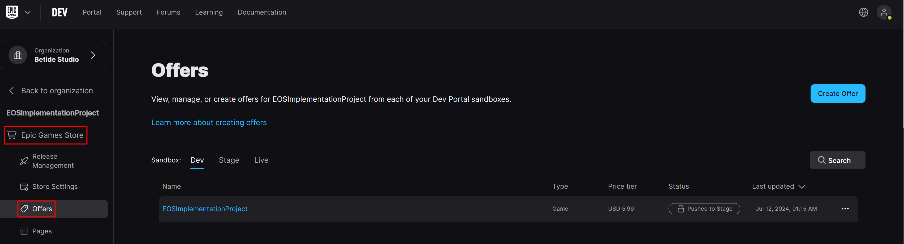
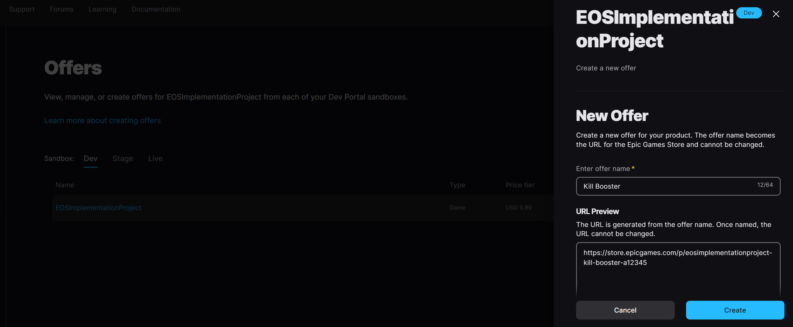
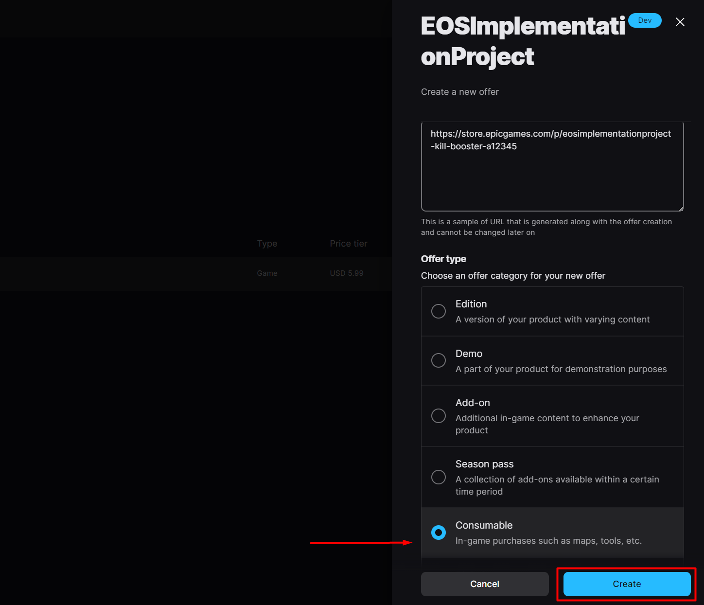
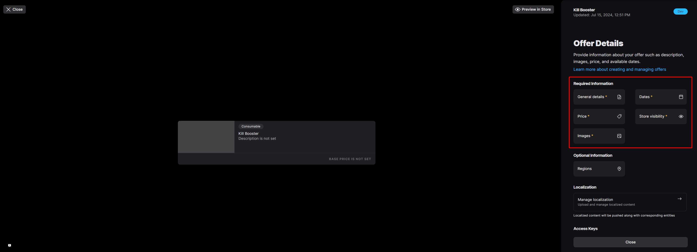
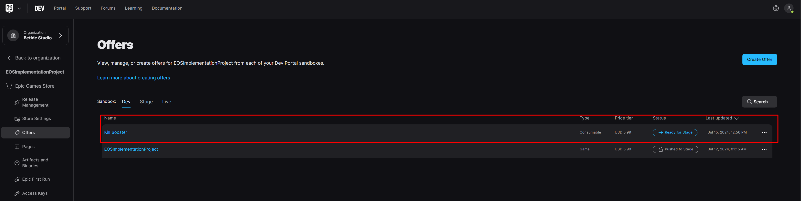
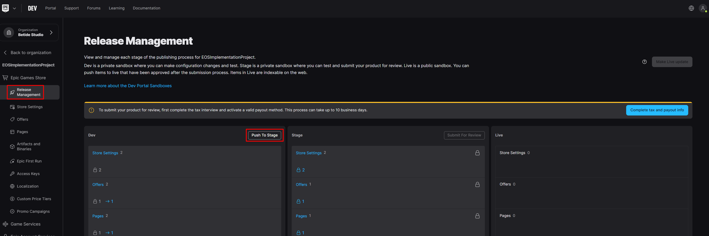
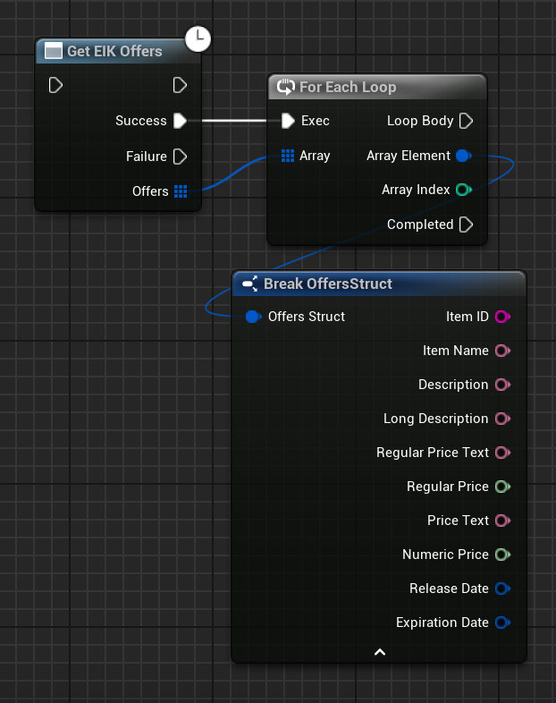
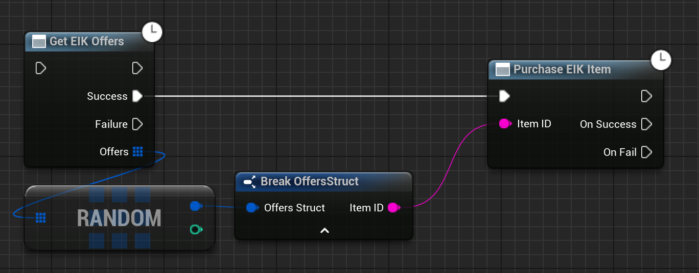
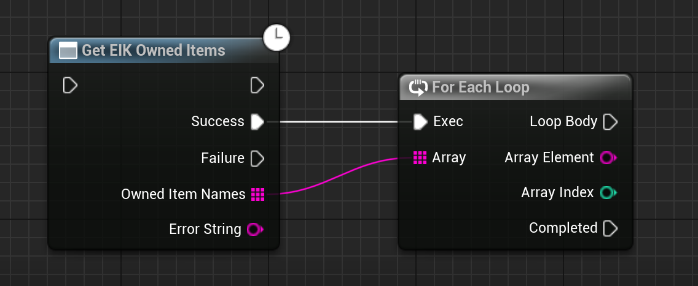

import { Callout } from 'nextra/components'

# Product Offers/Items

<Callout type="info">
    - You need to have a product created in the Epic Games Store, that means you should have paid the $100 fee to become a developer.
    - You cannot test this feature in the editor, the game has to be launched through the Epic Games Store, even if it's in development sandbox mode.
 </Callout>

Offers are the items people can buy related to your product, including the main product itself. In the Epic Games Store publishing tools, key details about your product, like when it’s available and its price, are kept in the offer section.

When you first set up your product, an offer for the main product, called the base product offer, is automatically created. You can also make extra offers for users to buy or download additional content that improves your product. These extra offers can include things like demos, special editions, add-ons, season passes, consumables, or digital extras.

## Creating an Offer

1. Go to the **Offers** section in the Epic Games Store publishing tools.

  

2. Click **Create Offer** and it should pop-up a window with the following fields:

- **Offer Name**: The name of the offer/item that you want to create.
- **Offer Type**: The type of offer you want to create. This can be a lot of things, like a demo, a special edition, a season pass, etc. We will be selecting  **Consumable** for this example.

  

  

3. After the base offer is created, you have to configure the offer details. There are a lot of required fields:

  

These fields will be completely different depending on the type of offer you are creating. I will go ahead and quickly fill the fields for a consumable offer:

4. After you have filled all the required fields, click **Save** and your offer will be created. On the main offers page, you should see the offer with status as **Ready for stage**.

  

5. Now under the **Release Management** section, you can push the offer to the store by clicking **Push to Stage**.

  

## Game Code Integration

### Get available offers

You can get the available offers for your product by calling the `GetOffers` function. This function will return a list of offers that are available for the product.

  

### Purchase an offer

You can start the purchase flow for an offer by calling the `PurchaseOffer` function. 

  

### Getting owned offers

You can get the offers that the user has already purchased by calling the `Get EIK owned items` function.

  
