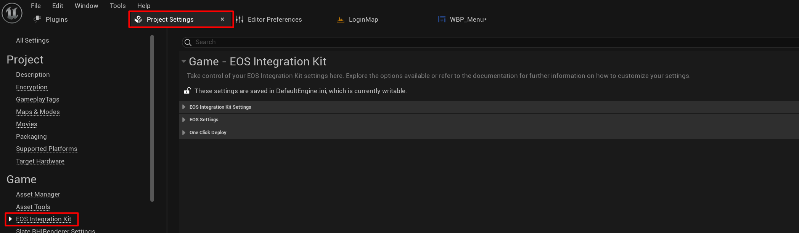
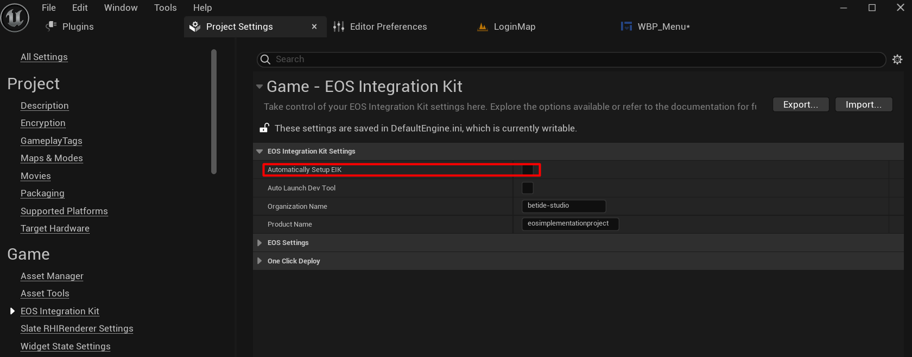
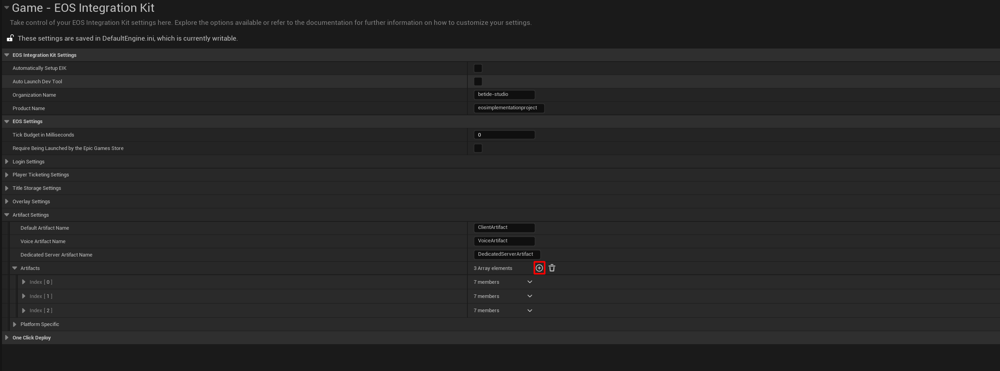
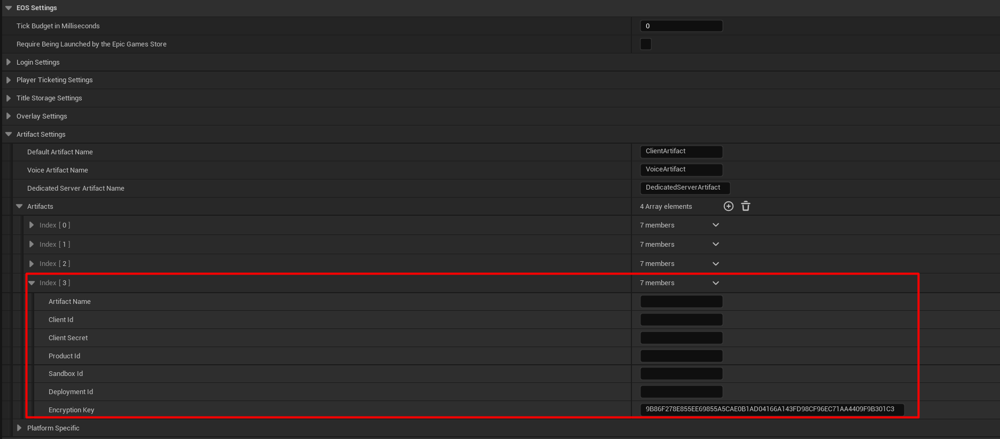
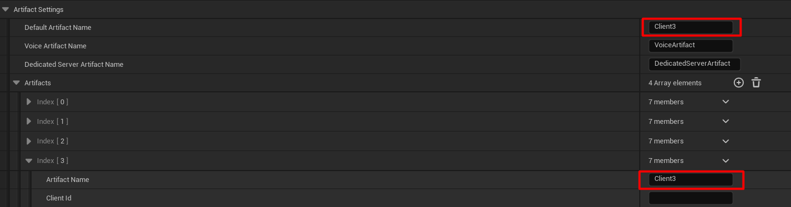
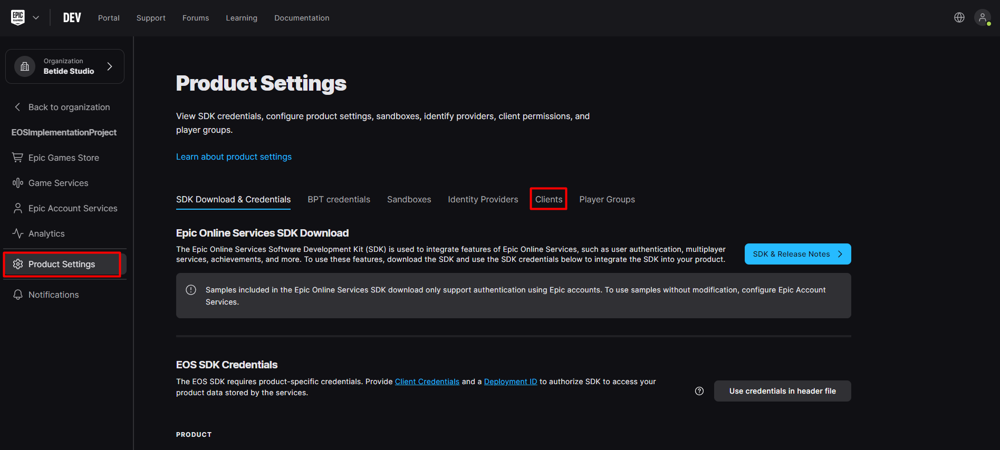
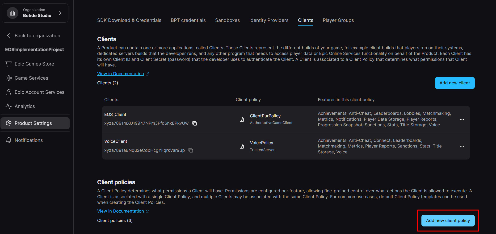
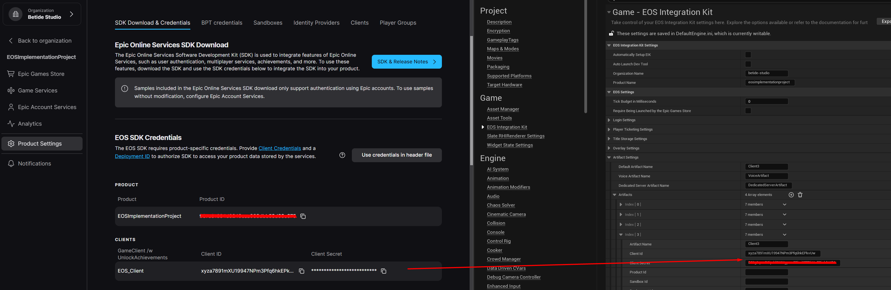

import { Callout } from 'nextra/components'

# Configuration 

Configuring the EOS Integration Kit plugin is a simple process. Let's go through the steps to configure the plugin.

## Plugin Basics

After the plugin is installed and set to active, you can configure it by going to the plugin settings page. The settings page can be found in **Project Settings** -> **Game** -> **EOS Integration Kit**.

  

## DefaultEngine.ini Configuration

### Automatic Configuration

If you turn on the **Automatically setup EIK** option under **EOS Integration Kit Settings**, the plugin will automatically add the required configuration to the `DefaultEngine.ini` file. This is the recommended way to configure the plugin.

  

### Manual Configuration

If you prefer to manually configure the plugin, you can add the following configuration to the `DefaultEngine.ini` file.

```ini
[OnlineSubsystem]
DefaultPlatformService=EIK

[OnlineSubsystemEIK]
bEnabled=true

[/Script/Engine.GameEngine]
!NetDriverDefinitions=ClearArray
+NetDriverDefinitions=(DefName="GameNetDriver",DriverClassName="OnlineSubsystemEIK.NetDriverEIK",DriverClassNameFallback="OnlineSubsystemUtils.IpNetDriver")
```

## Artifact Configuration

So, what are artifacts? Artifacts are group of settings that are used to configure the EOS SDK. The EOS SDK requires a set of configuration settings to be passed to it in order to function correctly. These settings are grouped into artifacts.

To add a new artifact, click on the **+** button under **Artifacts**.

  


You should now see a new artifact added to the list. Click on the artifact to expand it.

  


### Artifact Settings

#### Artifact Name

<Callout type="warning">
        Default Artifact name should not be empty. It should be set to one of the artifacts in the list.
</Callout>

The name of the artifact. This is used to identify the artifact in the plugin settings. To set this artifact as the default artifact, enter the same name in the **Default Artifact** field.

  

#### Client Id and Client Secret

The Client ID and Client Secret are used to authenticate the client with the EOS SDK. These values are provided by Epic Games when you register your application with the Epic Games Developer Portal.

Let's go through the steps to get the Client ID and Client Secret.

1. Go to the [Epic Games Developer Portal](https://dev.epicgames.com/portal/en-US/) and sign in with your Epic Games account.

2. Select the **Applications** tab from the left-hand menu or if you don't have any applications, click on the **Create Application** button.

3. After the application is created, under your application, you will find the **Clients** under the **Product Settings** tab.

  

4. Create a new client policy and select **Policy Type** as **Peer2Peer**.

    <Callout type="warning">
        There are a lot of settings/features that are not available for GameClient. If it doesn't suit your needs, you will have to create a custom policy and select the required features.
    </Callout>

   

5. After the client policy is created, create a new client and select the client policy that you created in the previous step.

  

6. After the client is created, you will find the **Client ID** and **Client Secret** on the **SDK Download & Credentials** tab.

  

7. Done! Copy the **Client ID** and **Client Secret** and paste them in the **Client Id** and **Client Secret** fields respectively of the artifact.

  

#### Product Id

The Product ID is used to identify the product that the client is associated with. 

Copy the **Product ID** from the **SDK Download & Credentials** tab of the client that you created in the previous step and paste it in the **Product Id** field of the artifact.

#### Sandbox Id

The Sandbox ID is used to identify the sandbox that the client is associated with, like Dev, Staging, or Production.

Copy the **Sandbox ID** from the **SDK Download & Credentials** tab of the client that you created in the previous step and paste it in the **Sandbox Id** field of the artifact.

#### Deployment Id

The Deployment ID is used to identify the deployment that the client is associated with.

Copy the **Deployment ID** from the **SDK Download & Credentials** tab of the client that you created in the previous step and paste it in the **Deployment Id** field of the artifact.

Done! You have successfully configured the EOS Integration Kit plugin.

Important: These configuration settings require the engine to be restarted in order to take effect.

## Troubleshooting

If you encounter any issues while configuring the plugin or have any questions, feel free to reach out to us on our [Discord server](https://discord.gg/betidestudio).