import { Callout } from 'nextra/components'

# Plugin Installation 

Great decision! You're about to install a plugin that will make your life easier. 

## Marketplace Edition

1. Open **Library** in the **Unreal Engine** section of the **Epic Games Launcher**.

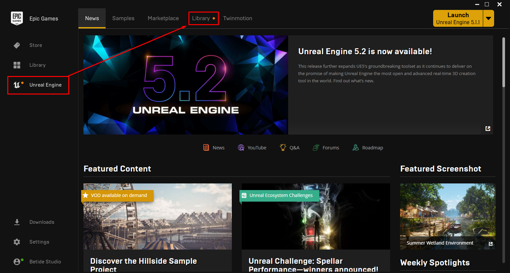  

2. Go to the **Vault** section and install `EOS Integration Kit`.

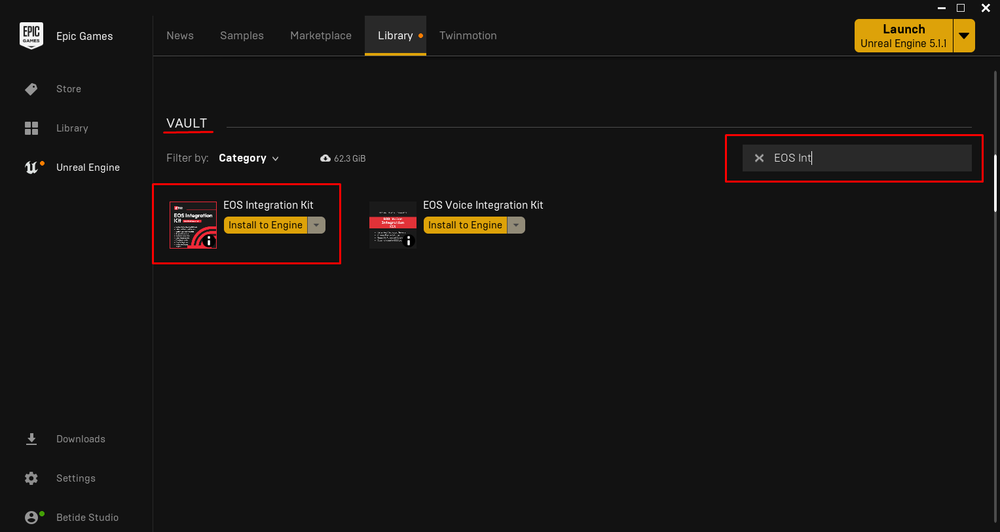  

3. Open the **Plugins** window in the **Unreal Engine** editor.

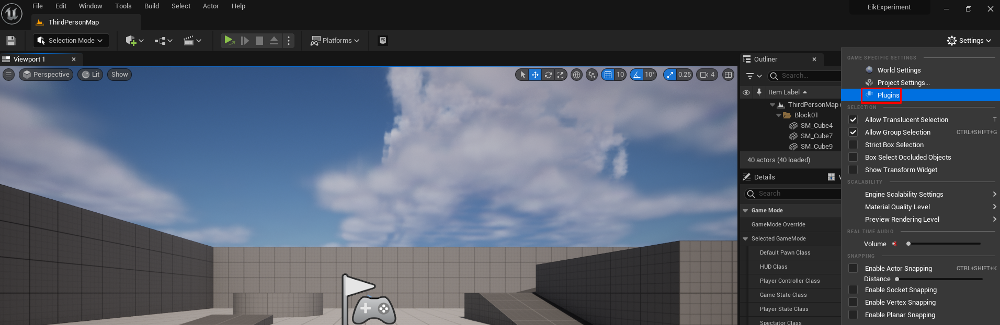  

4. Enable the plugin by checking the box next to `EOS Integration Kit`.

  

5. Restart the **Unreal Engine** editor.

Done! You've successfully installed the plugin.

## Source Edition

<Callout type="warning">
    Because the source version of the plugin is not compiled, you will need to compile it yourself before using it in your project. This is why you need a C++ project to use the source version of the plugin.
</Callout>

1. Clone the repository from [GitHub](https://github.com/betidestudio/EOSIntegrationKit) either using the `git clone` command or by downloading the repository as a ZIP archive. 

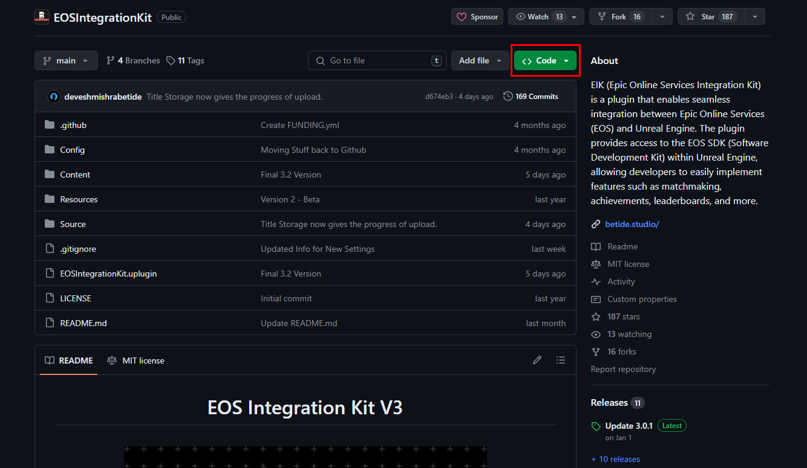  
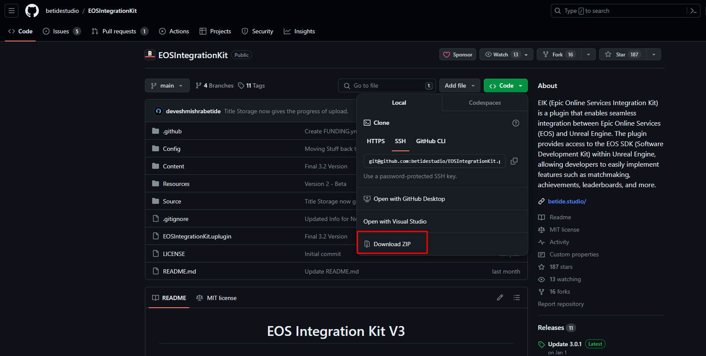  

2. Once downloaded, extract the contents of the ZIP archive to the `Plugins` folder of your Unreal Engine project.

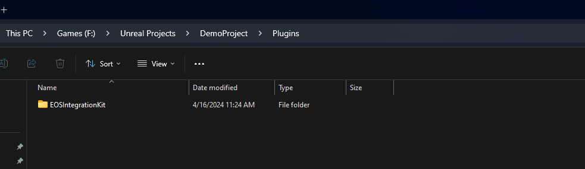  

3. Download the 1.16.4 [EOS SDK](https://dev.epicgames.com/portal/en-US/) from the Epic Games website. Download the SDK for the platform you are developing for.

- **Windows** : C SDK
- **Mac** : C SDK
- **Linux** : C SDK
- **Android** : Android SDK
- **iOS** : iOS SDK

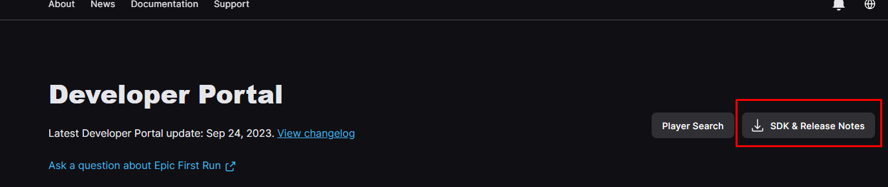  
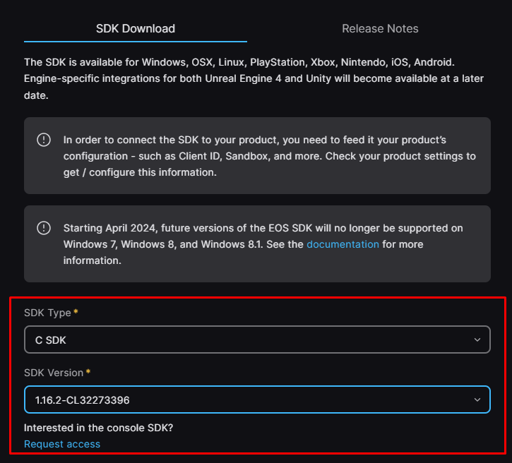  

4. Now we need to copy the SDK files to the plugin folder. The SDK files are located in the `SDK` folder of the downloaded ZIP archive. The SDK files are different for each platform. Let me guide you through the process.

### C SDK 

- Extract the downloaded ZIP archive and then copy the elements of the `SDK` folder to the `ThirdParty/EIKSDK` folder of the plugin.

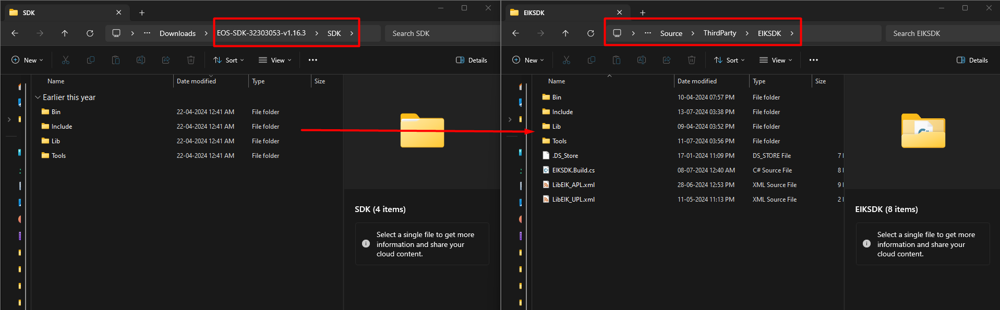  

### Android SDK

Starting EOS SDK V1.16.2, Epic Games doesn't provide the `libEOSSD.so` files for Android. So, we have to extract them from the SDK ourselves. Let's go through the steps.

- From the unzipped SDK folder, navigate to `SDK\Bin\Android\static-stdc++\aar` and extract the `eossdk-StaticSTDC-release.aar` file using an archive manager like 7-Zip.

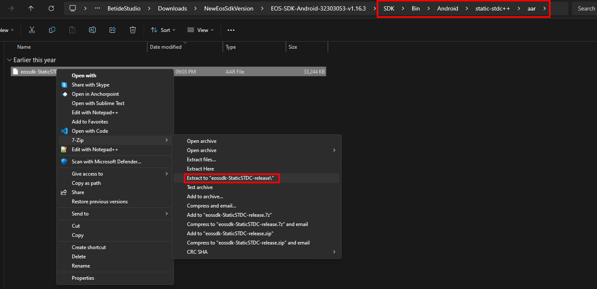  

- Now from the extracted files, navigate to `eossdk-StaticSTDC-release\jni` and copy all the folders and files to the `ThirdParty/EIKSDK/Bin/Android` folder of the plugin. The folder should look like this :

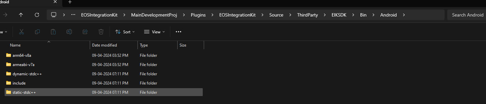  

- Copy the **includes** from the extracted files to the `ThirdParty/EIKSDK` folder of the plugin. The new folder structure should look like this :

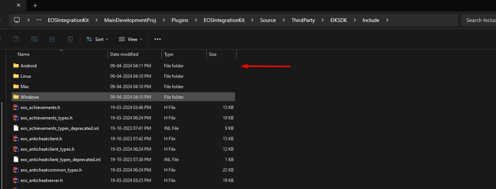  

### iOS SDK

- Extract the downloaded ZIP archive and then copy the elements of the `SDK` folder to the `ThirdParty/EIKSDK` folder of the plugin, same as the C SDK.

To verify that the SDK files are copied correctly, the folder structure of `ThirdParty/EIKSDK/Bin/IOS` should look like this :

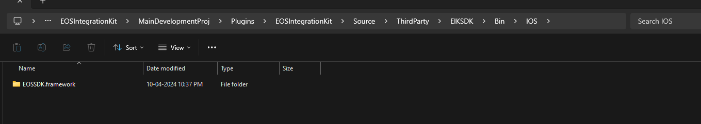  

### Back to the unified steps

5. Now right click on the `.uproject` file of your project and select `Generate Visual Studio project files`.

  

6. Open the generated `.sln` file in Visual Studio and compile the project.

7. Once compiled, open the **Plugins** window in the **Unreal Engine** editor and enable the plugin by checking the box next to `EOS Integration Kit`.

  

8. Restart the **Unreal Engine** editor.

Done! You've successfully installed the plugin.