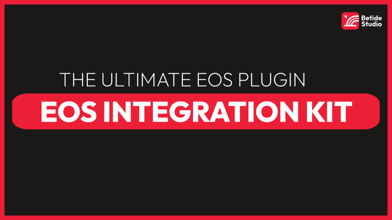

import { Callout } from "nextra-theme-docs";
import { Tabs, Steps, Cards, Card } from "nextra/components";

# EOS Integration Kit

  

EOS Integration Kit (EIK) is the **ULTIMATE** plugin for integrating Epic Online Services (EOS) with Unreal Engine. It provides a simple and easy-to-use interface to interact with the EOS SDK. Not only that, but it also provides complete EOS SDK exposure in blueprints.

## Important Information

- **Plugin Version**: 4.0.0
- **Unreal Engine Version**: 4.27 and above
- **Current EOS SDK Version**: 1.16.3
- **Supported Platforms**: Windows, Mac, Linux, Android, iOS with support for consoles coming soon.

## Features

All the below features are available in both C++ and Blueprints and are fully documented. Please note that the COMPLETE EOS SDK is exposed in blueprints too which is not included in the list below.

1. **Diverse Login Options**: Login with Epic, Device, Google, Apple, Steam, Oculus and much more.
2. **Lobby System**: Create, Join, Leave, Destroy, Update, Promote, Kick, Invite, Attribute, and much more.
3. **Friends System**: Add, Remove, Query, Block, Unblock, and much more.
4. **Presence System**: Set, Query, Subscribe, Unsubscribe, and much more.
5. **Leaderboards**: Read, Write, Query, and much more.
6. **Achievements**: Unlock, Query, and much more.
7. **Stats**: Read, Write, Query, and much more.

and much much much more...

## SDK Interfaces Exposed

This should be used by **Advanced Users** who want to interact with the EOS SDK directly. The following interfaces are exposed in the plugin:

- Achievements Interface
- Anti-Cheat Interface
- Auth Interface
- Connect Interface
- Ecom Interface
- Friends Interface
- Leaderboards Interface
- Lobby Interface
- Metrics Interface
- Mods Interface
- P2P Interface
- PlayerDataStorage Interface
- Presence Interface
- Reports Interface
- RTC Interface
- Sanctions Interface
- Sessions Interface
- Stats Interface
- TitleStorage Interface
- UI Interface
- UserInfo Interface

## Support

If you have any questions or need help, feel free to join our [Discord Server](https://discord.gg/betidestudio) or contact us at [support@betide.studio](mailto:support@betide.studio)