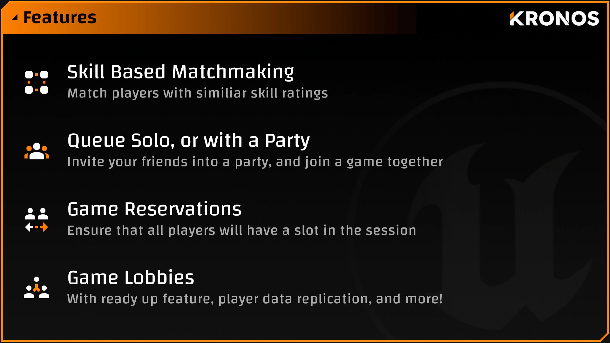
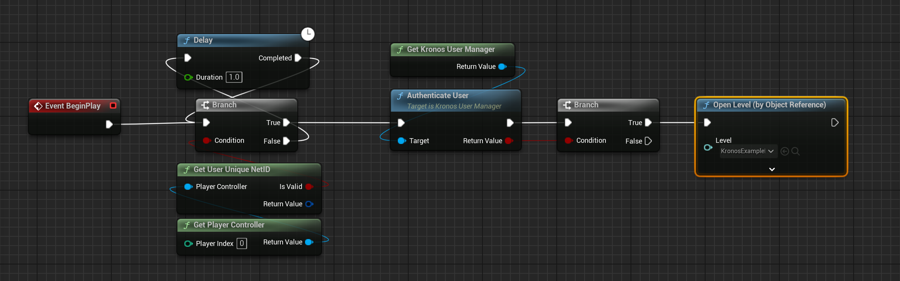
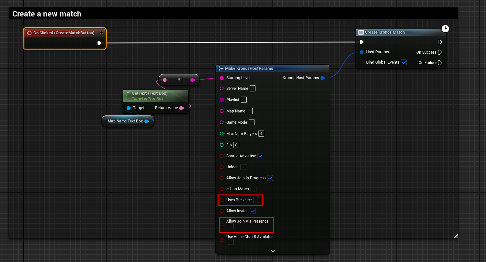
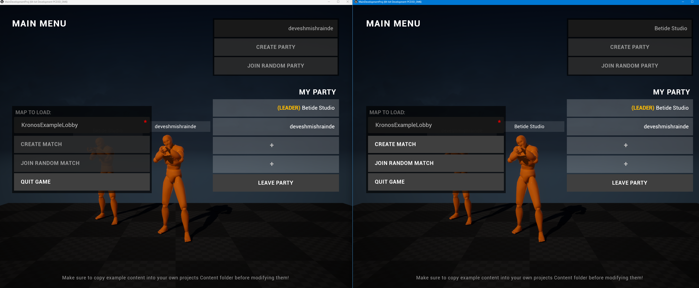

import { Callout } from "nextra-theme-docs";

# Integrating Kronos Matchmaking with EIK

  

[Kronos Matchmaking](https://www.unrealengine.com/marketplace/en-US/product/kronos-matchmaking) is one of the best and complete client-sided matchmaking solutions available at the moment on the Unreal Engine Marketplace. It provides a lot of features and flexibility to create a matchmaking system that fits your game's needs.

We know this took a while, but we finally have a guide on how to integrate Kronos Matchmaking with EIK. This guide will show you how to set up the matchmaking system and how to integrate it with EIK.

<Callout type="warning">
    Kronos Matchmaking requires Beacons to be working which are not supported by most EOS plugins but EIK now supports it for version 4.2.0 and above.
</Callout>

## Setting Up Kronos Matchmaking

For the following code, I am using Autologin with EIK and the method is `DevTool`. You can use any method you want, but make sure to change the code accordingly.

Make a new empty map that will be used for Authentication. I have named this map `LoginMap`. Now on event begin play of this map, add the following code:

  

In case you are not using the autologin feature, you can use the normal login methods and do a level switch on successful login.

## Presence Issues

By default, Kronos Matchmaking creates all the sessions with the `bUsePresence` flag set to `true`. But in EOS, the presence can only be used for one session at a time. So, if you are using EIK, you need to disable the presence in the widgets where you are creating the sessions. 

Like for us, it was in the `WBP_KronosExampleMenu` widget. So, we disabled the presence in the `CreateSession` function.

  

<Callout type="error">
	ADVANCED USERS : Do not increase the **LogLobbyBeacon** verbosity to **VeryVerbose** as it will crash the engine. We have already pushed a fix to this on [Unreal Engine's GitHub](https://github.com/EpicGames/UnrealEngine/pull/12306/)
</Callout>

## Conclusion

  

This is how you can integrate Kronos Matchmaking with EIK. If you have any questions or need help with the integration, feel free to ask in the [EIK Discord Server](https://discord.gg/betidestudio).