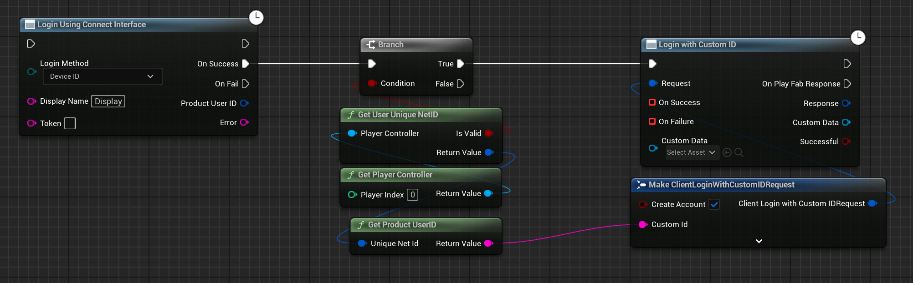
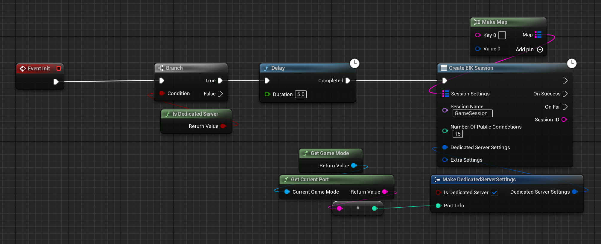
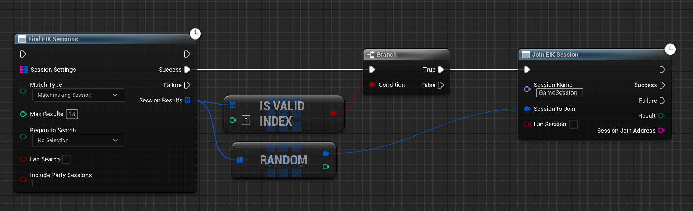

import { Callout } from "nextra-theme-docs";

# Integrating PFIK with EIK

[Playfab Integration Kit V2](https://www.unrealengine.com/marketplace/en-US/product/playfab-integration-kit-v2) is a plugin that allows you to integrate Playfab with Unreal Engine. It provides a simple interface to interact with Playfab services like Advanced Matchmaking, Dedicated Servers, Authentication, Player Data, Leaderboards, and more.

This guide will walk you through the process of integrating Playfab Integration Kit with EOS Integration Kit so that you can take advantage of both services in your game.

## Prerequisites

- Both plugins should be installed in your Unreal Engine project.
- Playfab and EOS should be set up and configured for your project. Please note that you can make sure the **DefaultEngine.ini** file is set up for EOS Integration Kit as mentioned here.

## Connected Login

One of the key features of the merge between PFIK and EIK is the ability to create a connected login system that allows players to log in using their EOS account and link it to their Playfab account. This way, players can access Playfab services using their EOS account, and vice versa. Now being honest, this is not a official link but a way to make sure that the player can access both services using the same account.

<Callout type="info">
    We are just using DeviceId for example purposes. You should use the actual login method you want to use. We use ProductUserId to link the accounts, which will be available for all login methods.
</Callout>

After the login of EOS is successful, you can call the following function to link the EOS account with the Playfab account:

  

## Dedicated Servers

<Callout type="info">
    If you are using Playfab's server, I will suggest you to use the Playfab's matchmaking system if you want server sided matchmaking. If you are using EOS's matchmaking system, be sure to know that it's a local client side matchmaking system.
</Callout>

As you know, EOS Integration Kit provides a way to create and manage dedicated server sessions but not the actual servers themselves. Let's say you are using Playfab's dedicated servers and want to use EOS Integration Kit for managing the sessions. You can do this by creating a session in EOS on the server and then finding and joining the session on the client side.

### Server Side Setup

Make sure your Artifact Settings are set up correctly in the EOS Integration Kit settings. You can find more information about this [here](/multiplayer/dedicatedservers/configuration)

Then on the Game Instance, check if the current one is a dedicated server and create a session:

  

### Client Side Setup

On the client side, you can find and join the session using the following code:

  

## Other Features

Now because these accounts are linked, you can use the Playfab services like you would normally do. For instance, if you save a inventory item in Playfab, you can access it using the EOS account's ProductUserId. This way, you can use the services of both platforms in a seamless way.