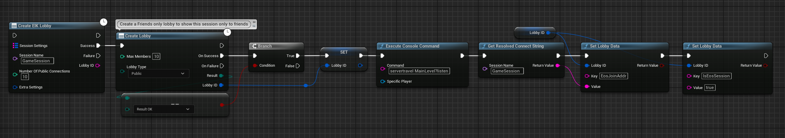
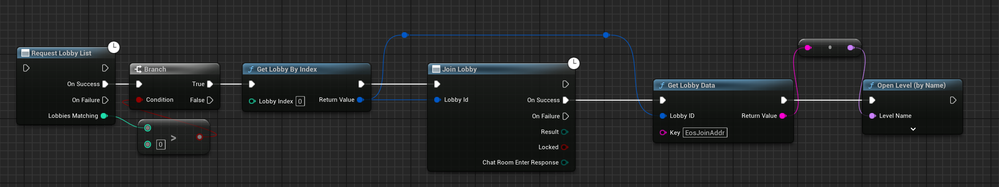

# Integrating SIK with EIK

  

[Steam Integration Kit (SIK)](https://www.unrealengine.com/marketplace/en-US/product/steam-integration-kit) is a plugin that provides a set of Blueprints and C++ classes to help you integrate Steam features into your Unreal Engine project. The plugin is designed to work with the [Epic Online Services (EOS) Integration Kit (EIK)](https://www.unrealengine.com/marketplace/en-US/product/eos-integration-kit) to provide a seamless experience for developers who want to use both Steam and EOS in their projects.

This guide will walk you through the process of integrating SIK with EIK so that you can take advantage of both plugins in your project.

## Prerequisites

- Both plugins should be installed in your Unreal Engine project.
- Steam and EOS should be set up and configured for your project.

## Setting Up **DefaultEngine.ini**

To integrate SIK with EIK, you need to set up the `DefaultEngine.ini` file in your project to specify the Default Subsystem as EIK and Platform Subsystems as SIK. This will ensure that the EOS subsystem is used as the main subsystem for online features, while the Steam subsystem is used for platform-specific features.

Add the following lines to the `DefaultEngine.ini` file in your project:

```ini
[OnlineSubsystem]
DefaultPlatformService=EIK
NativePlatformService=Steam
```

**PLEASE NOTE**: Make sure you do not add ANY net driver settings from SIK to the `DefaultEngine.ini` file. This will cause the EOS subsystem to not work correctly. Your final `DefaultEngine.ini` file should look like this:

```ini
[OnlineSubsystem]
DefaultPlatformService=EIK
NativePlatformService=Steam

[OnlineSubsystemEIK]
bEnabled=true

[/Script/OnlineSubsystemEIK.NetDriverEIK]
bIsUsingP2PSockets=true

[/Script/Engine.GameEngine]
!NetDriverDefinitions=ClearArray
+NetDriverDefinitions=(DefName="GameNetDriver",DriverClassName="OnlineSubsystemEIK.NetDriverEIK",DriverClassNameFallback="OnlineSubsystemUtils.IpNetDriver")

[OnlineSubsystemSteam]
bEnabled=True
SteamDevAppId=480
```


## Cross-Platform Session and Presence

One of the key features of the merge between SIK and EIK is the ability to create cross-platform sessions and manage player presence across multiple platforms. By integrating SIK with EIK, you can create sessions that are accessible to players on both Steam and EOS, allowing them to play together regardless of the platform they are using. Also, you can manage player presence across platforms, so that players can see their friends online and join their games, regardless of the platform they are using.

### Creating a Cross-Platform Lobby Session

To create a cross-platform lobby session that is accessible to players on both Steam and EOS, the flow is as follows:

1. Create a session on EOS using the `Create EIK Lobby` node.
2. Create a `Lobby` on Steam using the `Create Lobby` node, make sure you use the steamworks function as in the code below.
3. If the lobby creation on steam is successful, store the `Lobby ID` of the Steam lobby.
4. Now because the main subsystem is set to EIK, we just need to update the session of steam to have the join path of the EOS session. We will do this using the `Set Lobby Data` node, where we will set the `Join Path` to the `Resolved Address` of the EOS session.
5. Now players on both Steam and EOS can join the same lobby session.

  
Code available on [BlueprintUE](https://blueprintue.com/blueprint/uq2y1l99/)

**Note**: The above code is placed in the `GameInstance` class so that even after traveling to different levels, the session is maintained.

### Joining a Cross-Platform Lobby Session

#### From EOS

To join a cross-platform lobby session from EOS, the flow is the same as joining a regular EOS lobby session. You can use the `Find EIK Session` node to find the session you want to join and then use the `Join EIK Session` node to join the session.

#### From Steam

To join a cross-platform lobby session from Steam, the flow is also the same as joining a regular Steam lobby session. You can use the `Find Lobby` node to find the lobby you want to join and then use the `Join Lobby` node to join the lobby. After that, get the `Lobby Data` and extract the `Join Path` from it and join the level:

  


## Conclusion

Integrating SIK with EIK allows you to take advantage of both plugins in your Unreal Engine project and create a seamless experience for players on both Steam and EOS. 