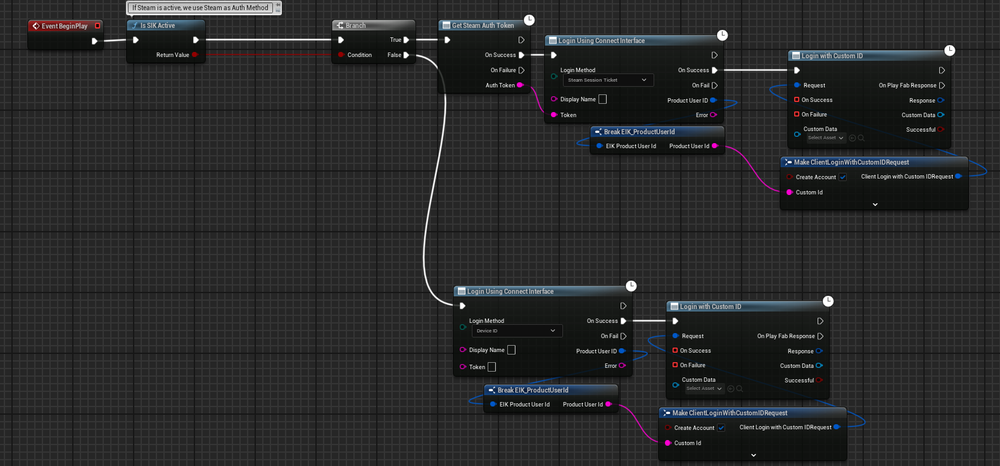

import { Callout } from "nextra-theme-docs";

# Integrating PFIK and SIK with EIK

## Some Common Questions

### 1. Why would someone want to use all the three plugins together?
It's simple, you can use the services of all three platforms in a seamless way for a better experience for the player, playing from any platform. 

Let me explain this with an example. Let's say you are launching a game on multiple platforms like Steam, Epic Games Store, and Android. You can use EOS Integration Kit for the cross-platform sessions, Playfab Integration Kit for Dedicated Servers and inventory management, and Steam Integration Kit for the Steam specific features like Achievements, Leaderboards, etc. 

### 2. Do all functions from each plugin work together?

Yes, because they basically don't rely on the Default Subsystem like other plugins do. They are independent of each other and can be used together without any issues.

### 3. Won't my game crash if I have SIK installed and running it from a non-Steam platform?

No, it won't. The Steam Integration Kit is designed in a way that it won't crash if it's not running on a Steam platform. Just make sure you have it set up correctly for the Steam platform because even on non-Steam platforms, it will look for the SDK and crash if it's not set up correctly.

## Prerequisites

- All three plugins should be installed in your Unreal Engine project.

## Setting Up **DefaultEngine.ini**

<Callout type="info">
    Make sure you do not add ANY NetDriver settings apart from the ones mentioned here. EIK Netdrivers support joining Dedicated Servers from Playfab and Steam, so you don't need to add any other net driver settings.
</Callout>

No special setup is required for PlayFab Integration Kit. But for Steam Integration Kit and EOS Integration Kit, you need to set up the `DefaultEngine.ini` file in your project to specify the Default Subsystem as EIK and Platform Subsystems as SIK. This will ensure that the EOS subsystem is used as the main subsystem for online features, while the Steam subsystem is used for platform-specific features.

```ini
[OnlineSubsystem]
DefaultPlatformService=EIK
NativePlatformService=Steam
```

**PLEASE NOTE**: Make sure you do not add ANY net driver settings from SIK to the `DefaultEngine.ini` file. This will cause the EOS subsystem to not work correctly. Your final `DefaultEngine.ini` file should look like this:

```ini
[OnlineSubsystem]
DefaultPlatformService=EIK
NativePlatformService=Steam

[OnlineSubsystemEIK]
bEnabled=true

[/Script/OnlineSubsystemEIK.NetDriverEIK]
bIsUsingP2PSockets=true

[/Script/Engine.GameEngine]
!NetDriverDefinitions=ClearArray
+NetDriverDefinitions=(DefName="GameNetDriver",DriverClassName="OnlineSubsystemEIK.NetDriverEIK",DriverClassNameFallback="OnlineSubsystemUtils.IpNetDriver")

[OnlineSubsystemSteam]
bEnabled=True
SteamDevAppId=480
```

## Connected Login

Let's add a connected login system that allows players to log in using their EOS account and link it to their Playfab account.

<Callout type="warning">
    Please note that PlayFab has Steam Authentication as a login method but we are using CustomId so that the player can access both services using the same account on different platforms, ofcourse if the account is linked.
</Callout>

  


## Listen Servers

As you want to use Cross-Platform Sessions, you can use the Listen Servers feature of EOS Integration Kit. Again, feel free to use the Playfab's matchmaking system if you want server-sided matchmaking or Steam's matchmaking system if you want to use the Steam subsystem.


## Other Features

Now because these accounts are linked, you can use the Playfab services like you would normally do. For instance, if you save an inventory item in Playfab, you can access it using the EOS account's ProductUserId. This way, you can use the services of all three platforms in a seamless way.

## Conclusion

This is how you can use all three plugins together in your Unreal Engine project. If you have any questions or need help, feel free to ask in the [Discord Server](https://discord.gg/betidestudio).