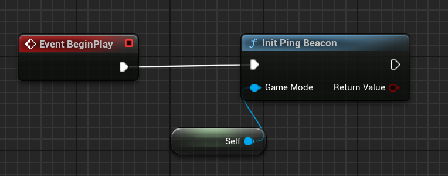
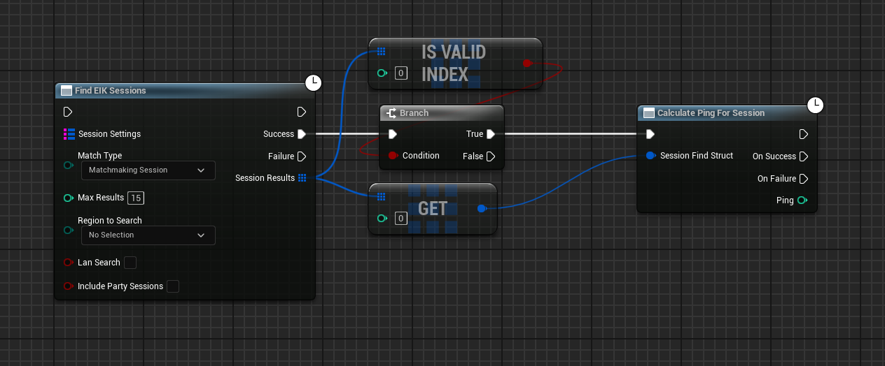

# Beacons with EOS Intergration Kit

EIK provides a way to integrate beacons into your game. 


## Beacon Configuration

### DefaultEngine.ini Configuration

Add the following configuration to your `DefaultEngine.ini` file to enable beacons in your game.

```ini
[/Script/Engine.GameEngine]
!NetDriverDefinitions=ClearArray
+NetDriverDefinitions=(DefName="GameNetDriver",DriverClassName="OnlineSubsystemEIK.NetDriverEIK",DriverClassNameFallback="OnlineSubsystemUtils.IpNetDriver")
+NetDriverDefinitions=(DefName="BeaconNetDriver",DriverClassName="OnlineSubsystemEIK.NetDriverEIK",DriverClassNameFallback="OnlineSubsystemUtils.IpNetDriver")
```

## Ping

So, EIK V4.5 introduces a node to ping sessions and Ip. This is useful for checking if a session is still active or how good the connection is.

### Server Setup

To host a beacon, you need to create a `Init Ping Beacon` node. This node will create a beacon that will listen for pings from clients. We usually suggest to do it in the `Begin Play` event of the game mode.

  


### Client Setup

To ping a server, you either need to know the session info or the IP of the server. You can use the `Calculate Ping For Session` node to ping a session or the `Calculate Ping For Ip` node to ping an IP.

  


That is all you need to know to use beacons with EIK. If you have any questions, feel free to ask in the [Discord](https://discord.gg/betidestudio) server.