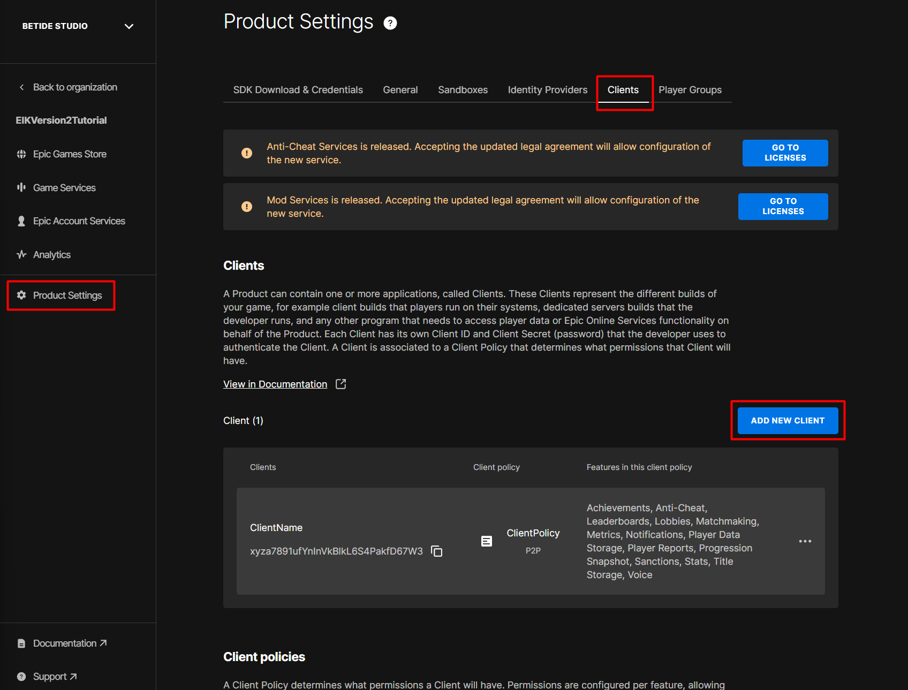
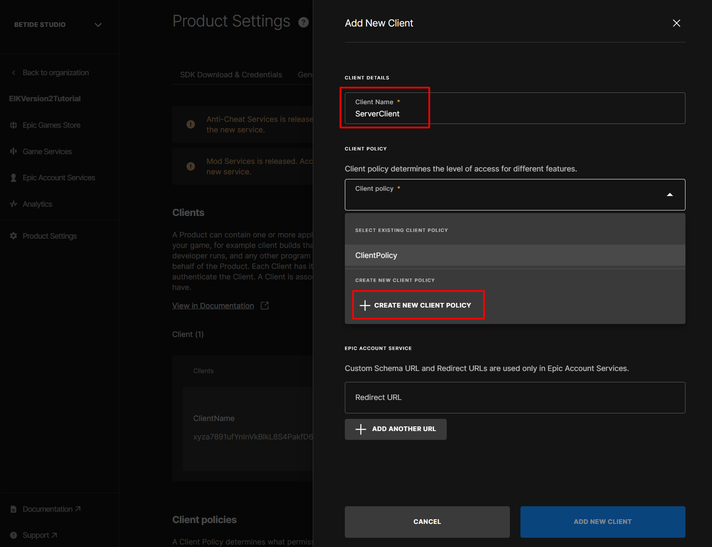
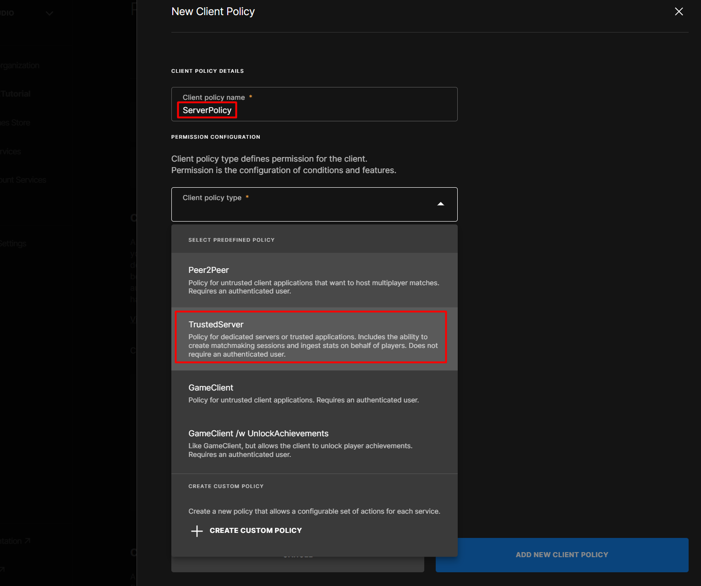
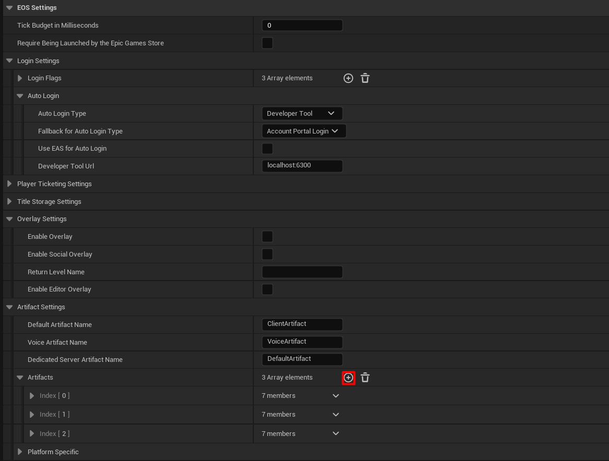
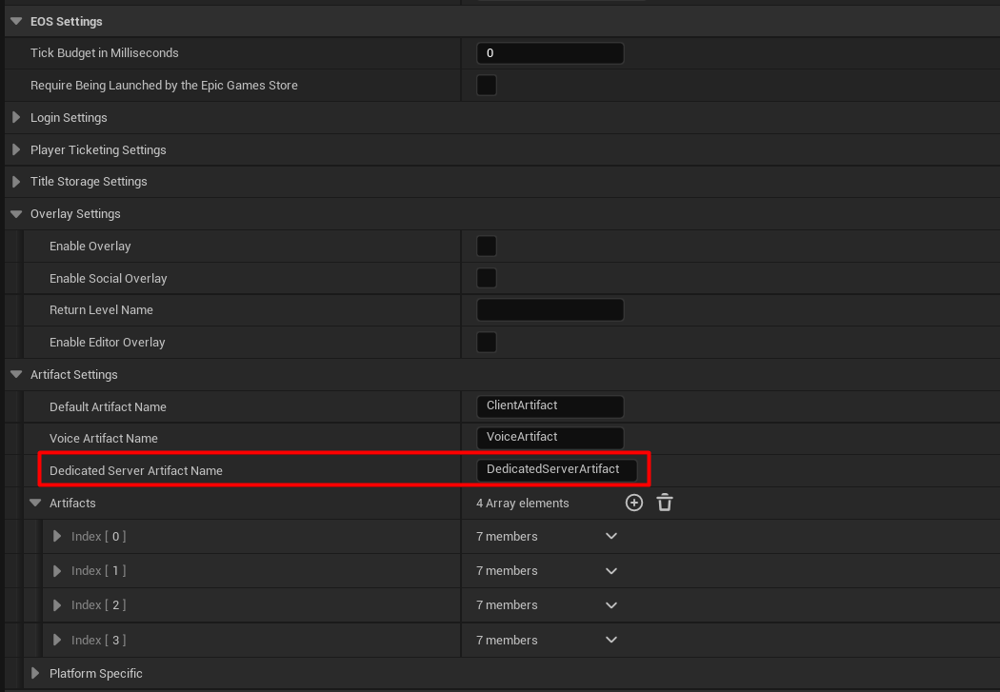
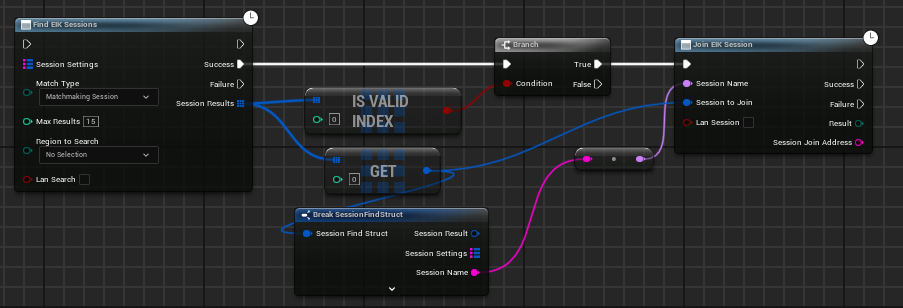

# Configuration for Dedicated Servers

## Artifact Settings

### Setting up the Artifact on EOS Dev Portal

1. Go to the [EOS Dev Portal](https://dev.epicgames.com/portal/en-US/) and select the organization and then the app you want to use.

2. Now under **Product Settings**, click on **Clients** and then **Add New Client**.
  

3. Name the client as `DedicatedServerClient` or something, your call lol. Now, under the **Client policy** section, select **Create New Policy**.

  

4. Name the policy as `DedicatedServerPolicy` or something, again, your call. Now, under the **Client Policy type** section, select **TrustedServer**.

  

5. Lastly, just select the policy you just created and click **Save**.

### Setting up the Artifact in Unreal Engine

Now that you have the Artifact set up on the EOS Dev Portal, you can now set it up in Unreal Engine.

1. Open the Editor and go to **Edit** > **Project Settings** > **Game** > **EOS Integration Kit**.

2. Under **EOS Settings** > **Artifact Settings**, add a new Artifact by clicking on the **+** button.

  

3. Now on the newly created Artifact, set the **Artifact Name** to `DedicatedServerArtifact` or something, your call. Then, copy the values for all the fields from the EOS Dev Portal > **Product Settings** > **SDK Download & Credentials**.

4. When you have that done, copy the **Artifact Name** you entered and paste it in the **Dedicated Server Artifact Name** field.

  

5. Restart the Editor and you should be good to go.

## Netdriver Settings

Want to hear a good news? You don't have to do anything here! EIK will handle all the Netdriver settings for you. Just make sure you have the correct config settings in your `DefaultEngine.ini` file.

## Creating a Dedicated Server Session

As we talked about in the [Sessions](/multiplayer/matchmaking/sessions) page, you can create a session for a dedicated server as well, but not a lobby. The process is the same as creating a session for a listen server, but with a few changes.

1. Create a session with the `bIsDedicatedServer` flag set to `true` and `PortInfo` usually set to your current game port.

<iframe src="https://blueprintue.com/render/i3c6mzn8/" scrolling="no" allowfullscreen width="100%" height="400px"></iframe>
Cannot view the code? [Click here](https://blueprintue.com/render/i3c6mzn8/)

2. That is it! You have successfully created a dedicated server session :D

## Finding and Joining a Dedicated Server Session

Finding a dedicated server session is the same as finding a listen server session. Just make sure you use `Matchmaking Sessions` as the `Match Type`.

  

## Important Notes/Tips/FAQs

- You do not need to login the dedicated server to EOS as the policy we created on the EOS Dev Portal is a `TrustedServer` policy which does not required `User`. If you are making a custom policy, make sure to set `User Required` to `false`.
- If the server is locally hosted, you will not be able to join the server using the same machine as EOS would use External IP to connect to the server which ofcourse is not possible on the same machine. But you can join your server from same machine using `open localhost:7777` if the port is `7777`.
- Because our dedicated uses EOS Sessions, you have to follow all steps like Registering Players, Unregistering Players, etc. as you would do for a listen Session. More info on that [here](/multiplayer/matchmaking/sessions).