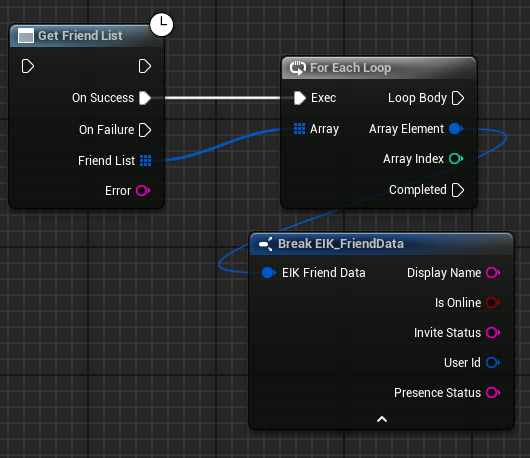
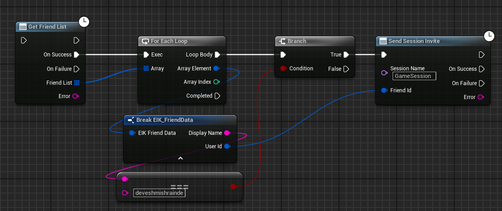
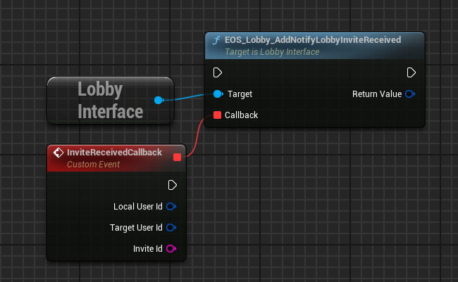
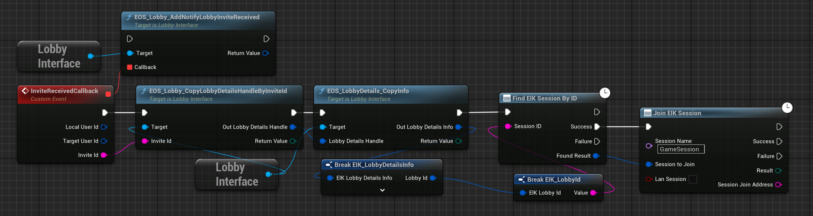
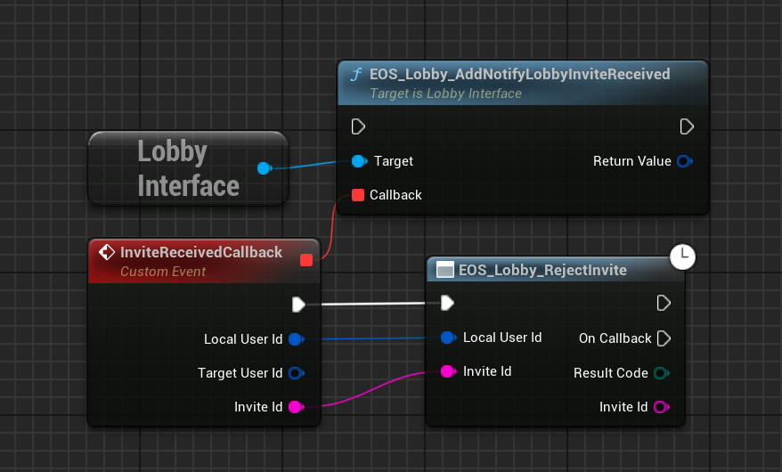

# Friends with EOS Integration Kit

Not everyone has a ton of friends, but with EIK, you can make sure the ones you do have never miss a game! (Thanks to AI for the joke, now you decide if they are funny or not)

## Getting Friend List

To get the list of friends, you need to call the following function:

  

This will load, and return the list of friends along with their presence status. Also, Epic doesn't have avatar support at the moment, unlike Steam.

## Invite Friends to Lobby/Sessions

To invite friends to a lobby or session, you need to call the following function:

  

SessionName is the name of the session you set when you created the lobby or session. 

## Listen and Accept/Reject Lobby Invites

### Listen to Lobby Invite Events

To listen to Lobby invite events, you need to bind the following delegate which you can do when the game starts:

  

### Accept Lobby Invite

You can accept the Lobby invite by calling the following function:

  

### Reject Lobby Invite

You can reject the Lobby invite by calling the following function:

  

