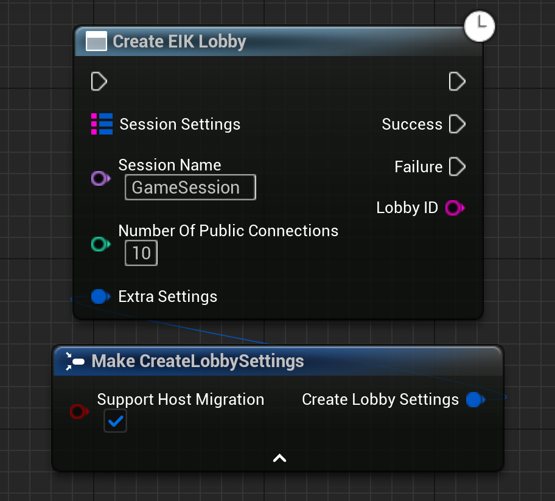
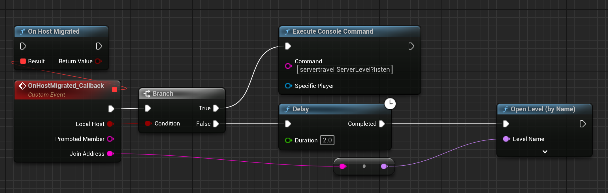

# Host Migration with EIK

Host migration is a feature that allows the game to continue running when the host leaves the game. This is useful for games that have a lot of players and need to keep the game running even if the host leaves.

## How it works

When the host leaves the game, EOS will automatically select a new host from the remaining players. After that, a callback will be triggered on all the clients to notify them that the host has changed. The new host will start the game and the players will join the new host.

## Implementation

### Lobby Creation

To implement host migration, you need to create a lobby with the `Create EIK Lobby` function with the UseHostMigration parameter set to true.

  

More info about creating a lobby can be found [here](/multiplayer/matchmaking/lobbies).

### Host Migration Callback

To receive the host migration callback, you need to implement the `OnHostMigrated` function. This function will be called when the host leaves the game and a new host is selected.

For the players that are not the new host, you need to call the OpenLevel function to join the new host.

For the new host, you need to server travel to the new level.

  

That is it! You have successfully implemented host migration in your game. Now your game will continue running even if the host leaves the game. Although the game state is not preserved, the players will be not left hanging and can continue playing the game.

