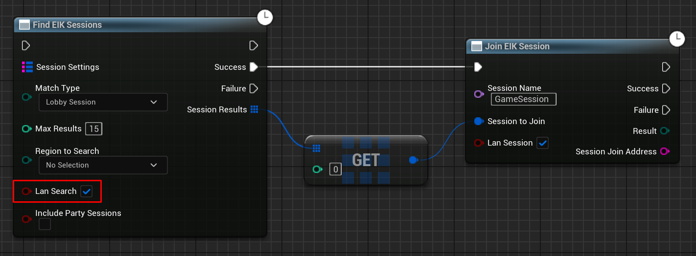

import { Callout } from 'nextra/components'

# Local Area Network (LAN) Sessions

- Sadly, the LAN feature is not available for OFFLINE games. You need to be authenticated to play with LAN feature.

## Creating a LAN Session

You can create a LAN session by just enabling the `Is LAN` option in the `Create EIK Lobby` node and boom! You have a LAN session.

<Callout type="info">
    When servertraveling to a LAN session, you need to use the `?bIsLanMatch` parameter in the URL. 
</Callout>

  

## Finding and Joining a LAN Session

To find and join a LAN session, you need to call the following function:

  

