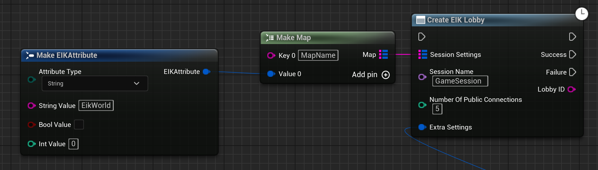
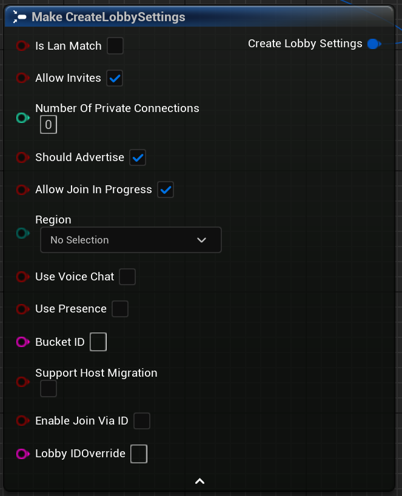

# Matchmaking Lobbies

Lobbies provide a persistent connection between users for the purpose of sharing game and user state with real-time updates. Typically, users can create or join lobbies to form teams, select pre-game options, and wait for additional players to join in before playing together. Using the Lobby Interface, your users can create, join, leave, and manage lobbies.

It's suggested to use lobbies when your game is only using peer-to-peer connections. If your game uses dedicated servers, you must use sessions. Dedicated servers cannot use lobbies.

## Creating a Lobby

To create a lobby, you need to call the `Create EIK Lobby` function. This function will create a new lobby and return the lobby id if the operation is successful.

 

<iframe src="https://blueprintue.com/render/rfma1zc5/" scrolling="no" allowfullscreen width="100%" height="400px"></iframe>
Cannot view the code? [Click here](https://blueprintue.com/render/rfma1zc5/)

Let's talk about the parameters of the `Create EIK Lobby` function in detail:

- `Session Settings` : This is map of key-value pairs that contain the settings for the lobby. You can use this to store any additional information about the lobby. For example, you can store the game mode, map name, or any other settings that you want find the lobby with. The key can only be a string and the value can be a string, boolean, or integer.
        In the example below, we are storing the map name in the session settings.

          
 
- `Session Name` : This is the name of the lobby. This is a string that is used to identify the lobby locally and can also be used to store to manage multiple lobbies. This is a required field and cannot be empty and no two lobbies can have the same name.
        In the example above, we are using the session name as "GameSession" which is also the default session name.

- `Number of Public Connections` : This is the number of public connections that can join the lobby. This is an integer and can be any number between 0 and 64. If the number of public connections is 0, then the lobby is private.
        In the example above, we are setting the number of public connections to 5.

   
Now, there are some settings that you can set for the lobby which you will find under `Extra Settings`:

  

- `IsLanMatch` : This is a boolean that is used to specify if the lobby is a LAN match. If this is set to true, then the lobby will be a LAN match and will not be advertised to the online services. This is useful when you want to play with friends on the same network.
- `Allow Invites` : This is a boolean that is used to specify if the lobby allows invites. If this is set to true, then the lobby will allow invites and the users can invite their friends to join the lobby.
- `Number of Private Connections` : This is the number of private connections that can join the lobby. This is an integer and can be any number between 0 and 64. If the lobby is private, then the number of private connections is the number of connections that can join the lobby. Private lobbies can be joined only by the users who have been invited to the lobby or presense of the user in the lobby.
- `Should Advertise` : This is a boolean that is used to specify if the lobby should be advertised. If this is set to true, then the lobby will be advertised and the users can find the lobby using the `Find EIK Session` function.
- `Allow Join In Progress` : This is a boolean that is used to specify if the lobby allows join in progress. If this is set to true, then the users can join the lobby even if the game has already started. This is useful when you want to allow users to join the game even after it has started.
- `Region` : [DEPRECIATED] This is a string that is used to specify the region of the lobby. This is useful when you want to find lobbies in a specific region. The region can be any string and is not restricted to any specific values.
- `Use Voice Chat` : This is a boolean that is used to specify if the lobby should use voice chat. If this is set to true, then the lobby will use voice chat and the users can communicate with each other using voice chat of lobby. We will discuss voice chat in detail in the next section.
- `Use Presence` : This is a boolean that is used to specify if the lobby should use presence. This means that the overlay will show the lobby information and friends can join the lobby from the overlay. Please note that at a given time, only one lobby can use presence.
- `Bucket Id` : This is a string that is used to specify the bucket id of the lobby. This is useful when you want to find lobbies in a specific bucket. Please do not use this unless you know what you are doing.
- `Support Host Migration` : This is a boolean that is used to specify if the lobby should support host migration. If this is set to true, then the lobby will support host migration and the host can migrate to another user if the host leaves the lobby. This is useful when you want to allow the game to continue even if the host leaves the lobby. We will talk about host migration in detail in the next section.
- `Enable Join Via Id` : This is a boolean that is used to specify if the lobby should allow users to join the lobby using the lobby id. If this is set to true, then the users can join the lobby using the lobby id. This is the same lobby id that is returned when the lobby is created.
- `Lobby Id Override` : This is a string that is used to specify the lobby id of the lobby. This is useful when you want to create a lobby with a specific lobby id. Please do note that their are specific rules for the lobby id like it should be minimum 4 characters etc. 

## Finding a Lobby

To find a lobby, you need to call the `Find EIK Session` function. This function will find the lobby based on the search settings and return all the lobbies that match the search settings.

 

<iframe src="https://blueprintue.com/render/2syyn191/" scrolling="no" allowfullscreen width="100%" height="400px"></iframe>
Cannot view the code? [Click here](https://blueprintue.com/render/2syyn191/)

Let's talk about the parameters of the `Find EIK Session` function in detail:

- `Session Settings` : This is map of key-value pairs that contain the settings for the lobby to search. You can use this to search for lobbies based on the settings that you have stored in the session settings. For example, you can search for lobbies with a specific map name or game mode. The key can only be a string and the value can be a string, boolean, or integer.
        In the `Create EIK Lobby` function, we stored the map name in the session settings. In the `Find EIK Session` function, we are searching for the lobbies with the same information:
        
          

- `Match Type` : This should be Lobbies for the matchmaking lobbies. 
- `Max Results` : This is the maximum number of results that you want to get. I personally use 20 as the maximum number of results.

   

## Joining a Lobby

To join a lobby, you need to call the `Join EIK Session` function. We will show a simple example of how you can join a lobby:

Here we just check if the first session is valid, and if it is, we join the first session. 

 
<iframe src="https://blueprintue.com/render/pld3g1g3/" scrolling="no" allowfullscreen width="100%" height="400px"></iframe>
Cannot view the code? [Click here](https://blueprintue.com/render/pld3g1g3/)

## Leaving/Destroying a Lobby

To leave a lobby or destroy a lobby, you need to call the `Destroy EIK Session` function. This function will leave the lobby if the user is in the lobby or destroy the lobby if the user is the host of the lobby.

 
<iframe src="https://blueprintue.com/render/8kgzixmh/" scrolling="no" allowfullscreen width="100%" height="400px"></iframe>
Cannot view the code? [Click here](https://blueprintue.com/render/8kgzixmh/)

## Updating a Lobby

To update a lobby, you need to call the `Update EIK Session` function. This function will update the lobby with the new settings that you provide.

 

<iframe src="https://blueprintue.com/render/f3ryuw6h/" scrolling="no" allowfullscreen width="100%" height="400px"></iframe>
Cannot view the code? [Click here](https://blueprintue.com/render/f3ryuw6h/)

The parameters of the `Update EIK Session` function are the same as the `Create EIK Lobby` function. The lobby name is used to identify the lobby that you want to update and the session settings are the new settings that you want to update the lobby with.

## Important Notes/FAQs

- **What happens if the host leaves the lobby?**

    If the host migration was enabled when the lobby was created, then the lobby will be migrated to another user. If the host migration was not enabled, then the lobby will be instantly and all the users will be disconnected from the lobby.