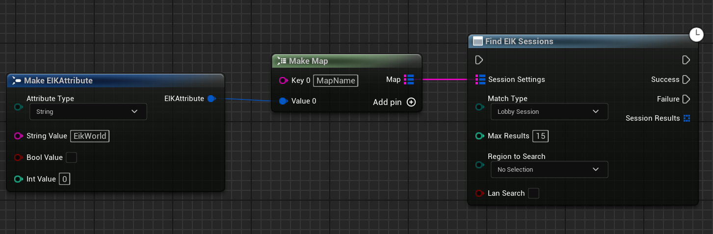
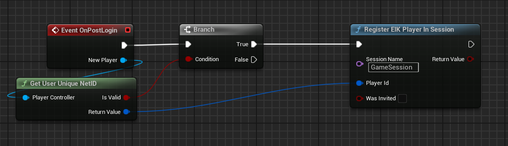
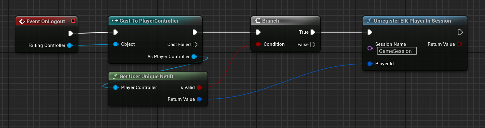
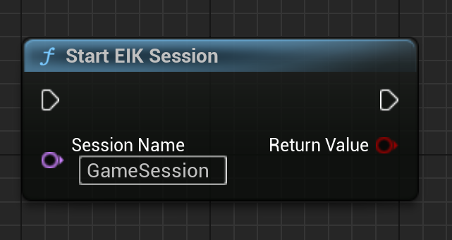
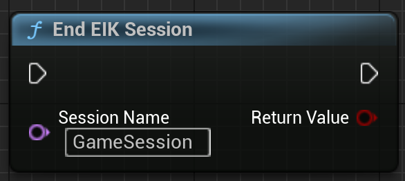

import { Callout } from 'nextra/components'

# Matchmaking Sessions

<Callout type="warning">
 Lobbies are a great way to create multiple matches. Only use sessions when you are using dedicated servers or lobbies do not meet your requirements.
 This is because lobbies make it very easy to manage/update a session and almost everything is automated there.
</Callout>

Epic Online Services (EOS) gives players the ability to host, find, and interact with online gaming sessions through the Sessions Interface. A session can be short, like filling a certain number of player slots before starting a game, then disbanding after the game ends, or it could be longer, like keeping track of a game that cycles through matches on multiple maps or levels. The Sessions Interface also manages game-specific data that supports the back-end service searching and matchmaking functionality.

## Creating a Session

To create a session, you need to call the `Create EIK Session` function. This function will create a new session and return the session id if the operation is successful.

 

<iframe src="https://blueprintue.com/render/i3c6mzn8/" scrolling="no" allowfullscreen width="100%" height="400px"></iframe>
Cannot view the code? [Click here](https://blueprintue.com/render/i3c6mzn8/)

Let's talk about the parameters of the `Create EIK Session` function in detail:

- `Session Settings` : This is map of key-value pairs that contain the settings for the session. You can use this to store the settings that you want to store in the session. The key can only be a string and the value can be a string, boolean, or integer. You can use this to find the session later using the `Find EIK Session` function.
- `Session Name` : This is the name of the session. This is used to identify the session. This is useful when you want to update the session or destroy the session.
- `Number of Public Connections` : This is the number of public connections that the session can have. I personally use 15 as the number of public connections but the maximum number of public connections is 1000 connections.

 
- `Is Dedicated Server` : This is a boolean that is used to specify if the session is a dedicated server. If this is set to true, then the session is a dedicated server. This is useful when you want to use a dedicated server for the session.
- `Port Info` : This is a string that is used to specify the port info of the session. This is useful when you want to use a specific port for the session. You can use `Get Current Port` function to get the current port and use that port for the session.

 
- `IsLanMatch` : This is a boolean that is used to specify if the session is a LAN match. If this is set to true, then the lobbsessiony will be a LAN match and will not be advertised to the online services. This is useful when you want to play with friends on the same network.
- `Allow Invites` : This is a boolean that is used to specify if the session allows invites. If this is set to true, then the session will allow invites and the users can invite their friends to join the lobby.
- `Number of Private Connections` : This is the number of private connections that can join the session. This is an integer and can be any number between 0 and 64. If the session is private, then the number of private connections is the number of connections that can join the lobby. Private lobbies can be joined only by the users who have been invited to the lobby or presense of the user in the lobby.
- `Should Advertise` : This is a boolean that is used to specify if the session should be advertised. If this is set to true, then the session will be advertised and the users can find the session using the `Find EIK Session` function.
- `Allow Join In Progress` : This is a boolean that is used to specify if the session allows join in progress. If this is set to true, then the users can join the session even if the game has already started. This is useful when you want to allow users to join the game even after it has started.
- `Region` : [DEPRECIATED] This is a string that is used to specify the region of the session. This is useful when you want to find lobbies in a specific region. The region can be any string and is not restricted to any specific values.
- `Use Presence` : This is a boolean that is used to specify if the session should use presence. This means that the overlay will show the session information and friends can join the session from the overlay. Please note that at a given time, only one lobby can use presence.

## Finding a Session

To find a session, you need to call the `Find EIK Session` function. This function will find the session based on the search settings and return all the sessions that match the search settings.

 

<iframe src="https://blueprintue.com/render/2syyn191/" scrolling="no" allowfullscreen width="100%" height="400px"></iframe>
Cannot view the code? [Click here](https://blueprintue.com/render/2syyn191/)

Let's talk about the parameters of the `Find EIK Session` function in detail:

- `Session Settings` : This is map of key-value pairs that contain the settings for the session to search. You can use this to search for lobbies based on the settings that you have stored in the session settings. For example, you can search for sessions with a specific map name or game mode. The key can only be a string and the value can be a string, boolean, or integer.
        In the `Create EIK Session` function, we stored the map name in the session settings. In the `Find EIK Session` function, we are searching for the lobbies with the same information:
        
          

- `Match Type` : This should be Session for the matchmaking Session. 
- `Max Results` : This is the maximum number of results that you want to get. I personally use 20 as the maximum number of results.

## Joining a Session

To join a session, you need to call the `Join EIK Session` function. This function will join the session based on the session id that you provide.

 

<iframe src="https://blueprintue.com/render/omxeevxl/" scrolling="no" allowfullscreen width="100%" height="400px"></iframe>
Cannot view the code? [Click here](https://blueprintue.com/render/omxeevxl/)

## Leaving/Destroying a Session

To leave or destroy a session, you need to call the `Destroy EIK Session` function. This function will destroy the session based on the session id that you provide.

 

<iframe src="https://blueprintue.com/render/8kgzixmh/" scrolling="no" allowfullscreen width="100%" height="400px"></iframe>
Cannot view the code? [Click here](https://blueprintue.com/render/8kgzixmh/)

## Updating a Session

To update a session, you need to call the `Update EIK Session` function. This function will update the session with the new settings that you provide.

 

<iframe src="https://blueprintue.com/render/f3ryuw6h/" scrolling="no" allowfullscreen width="100%" height="400px"></iframe>
Cannot view the code? [Click here](https://blueprintue.com/render/f3ryuw6h/)

The parameters of the `Update EIK Session` function are the same as the `Create EIK Session` function. The session name is used to identify the session that you want to update and the session settings are the new settings that you want to update the session with.

## Registering players to a session

To register a player to a session, you need to call the `Register Player` function. This function will register the player to the session based on the session name that you provide.

It is suggested to call this function after the player has successfully joined the session, in the gamemode.

  

## Unregistering players from a session

To unregister a player from a session, you need to call the `Unregister Player` function. This function will unregister the player from the session based on the session name that you provide.

  

## Start a session

To start a session, you need to call the `Start EIK Session` function. This function will start the session based on the session name that you provide.

This is majorly used to update the session status to `InProgress`, which means that the session is now in progress and the game has started. If while creating the session, you have set `Allow Join In Progress` to true, then the users can join the session even after the game has started.

  

## End a session

To mark a session as ended, you need to call the `End EIK Session` function. This function will end the session based on the session name that you provide.

This is majorly used to update the session status to `Ended`, which means that the session is now ended and the game has ended. This will not actually destroy the session, but will just mark the session as ended.

  
