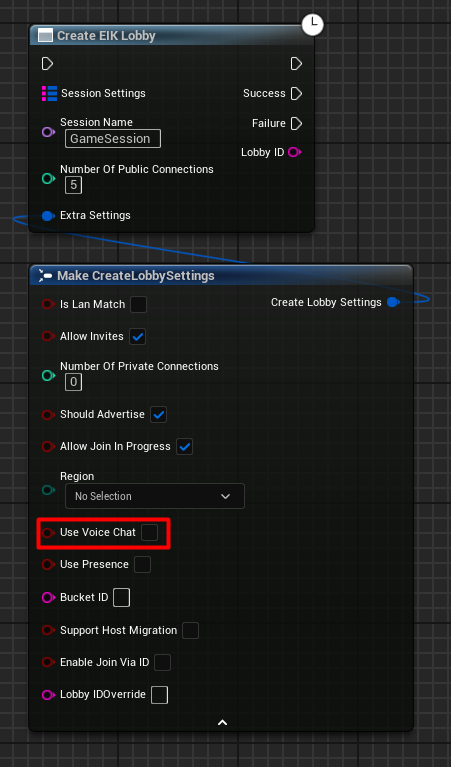
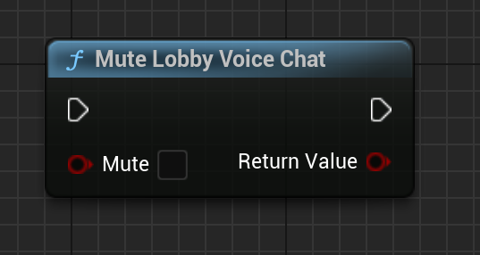
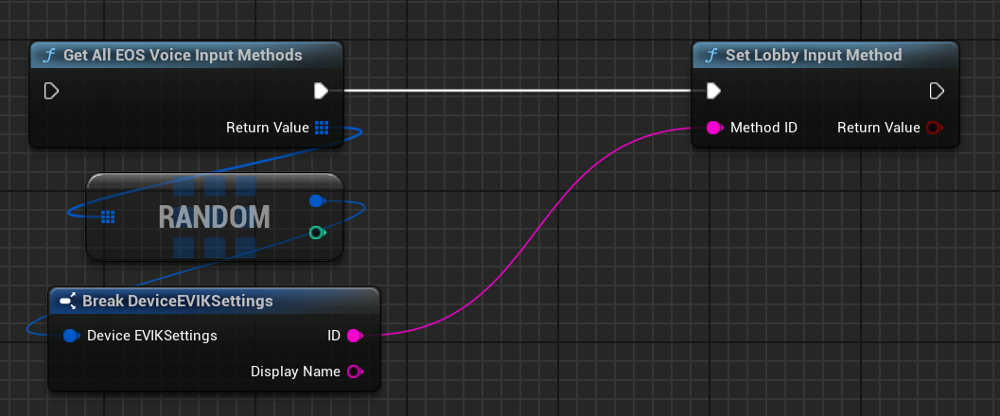
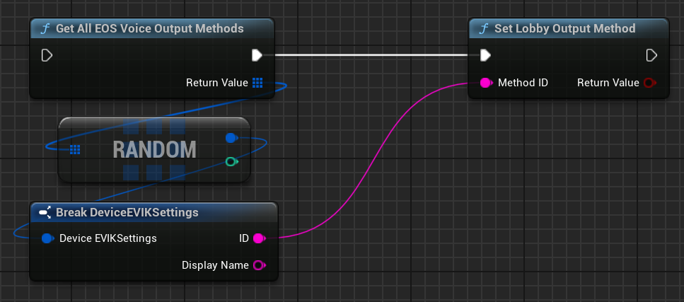
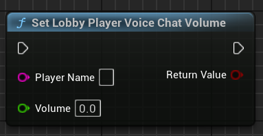
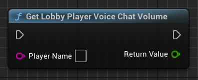

# Lobby based Voice Chat with EOS

Prior to version 4 of EOS Integration Kit, voice chat with lobby was not well done, like you could not control stuff. But now it is! You can now control the voice chat in the lobby as you want. This page will guide you on how to set up voice chat with lobby in your game.

## Setting up the Voice Chat

To set up voice chat with lobby in your game, the only thing need to be done is to enable the voice chat when creating the lobby session. Here is how you can do it:

  

Make sure you have the `Use Voice Chat` flag set to `true` when creating the lobby session. That is it! You have successfully set up voice chat with lobby in your game.

## Controlling the Lobby Voice Chat

There are many functions available now that you can use to control the voice chat in the lobby. Here are some of the functions that you can use:

### Mute/Unmute Player

You can now mute or unmute the local player with `Mute Lobby Voice Chat` function:

  

### Set Input Method

You can now set the input method for the voice chat with `Set Lobby Input Method` function:

  

In the above example, we get a random available input method and set it as the input method for the voice chat.

### Set Output Method

You can now set the output device for the voice chat with `Set Lobby Output Method` function:

  

### Set Player Volume

You can now set the volume of a player with `Set Lobby Player Volume` function:

  

The player name is `UniqueNetId` of the player you want to set the volume for. The volume is a float value between 0 and 1.

### Get Player Volume

You can now get the volume of a player with `Get Lobby Player Volume` function:

  

That is it! You can now control the voice chat in the lobby as you want. Have fun! :D