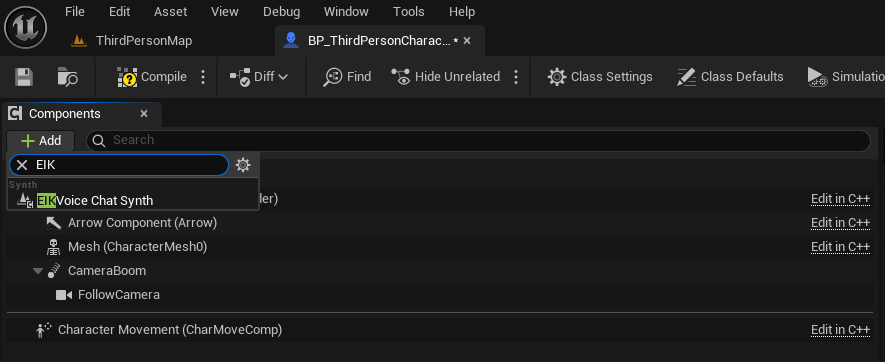
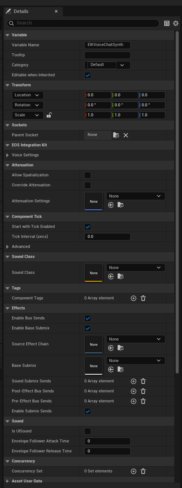
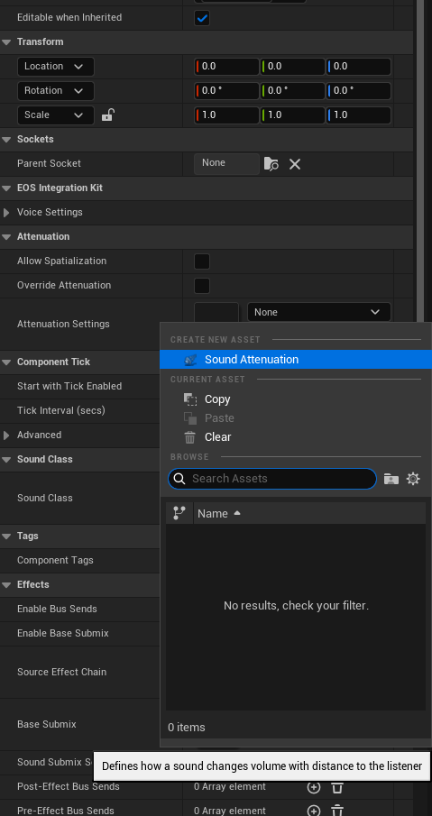
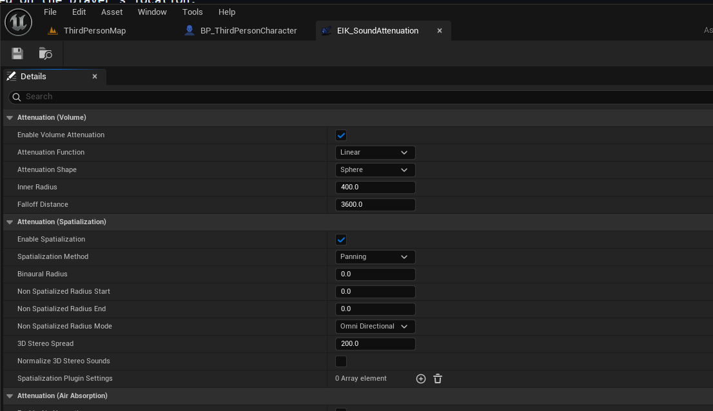

import { Callout } from 'nextra/components'

# Positional Voice Chat with EOS Integration Kit

- Requires Version 4.4.0 or higher of EOS Integration Kit - Special thanks to [Amir-BK](https://github.com/Amir-BK) for the support in implementing this feature.
- The feature is now fully implemented which means you can add effects to the voice chat based on the player's location.

One of the **major features** of the EOS Integration Kit is the ability to use Positional Voice Chat. This feature allows players to communicate with each other based on their in-game location.

## How to Use

### Step 1: Add the Component

On the *PlayerPawn* class, you need to add the **EIKVoiceChatSynthComponent** component:

  

On the right side, you should see all the settings for the component. You can adjust the settings as per your requirements.

  

### Step 2: Create Attenuation Settings

You need to create an **Attenuation Settings** asset. This asset will be used to control the voice chat's volume based on the player's location. 

  

### Step 3: Set the Attenuation Settings

Open the Attenuation Settings asset and set the values as per your requirements. For most cases, the default values should work fine.

  

## Conclusion

Boom, you are done! You have successfully implemented the Positional Voice Chat feature in your game. If you want to expand the settings, any Attenuation Settings asset can be used along with hundreds of other settings available in the component.

If you wanted something more expandable, do let us know as we are always looking for ways to improve the Positional Voice Chat feature.