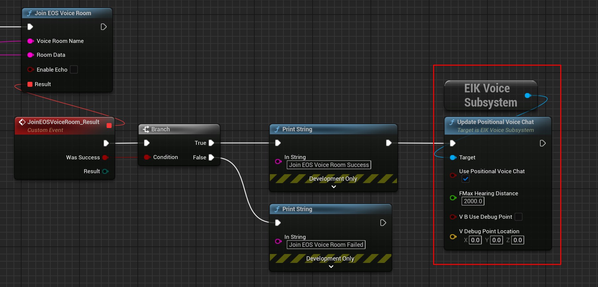

import { Callout } from 'nextra/components'

# Positional Voice Chat with EOS Integration Kit

- Requires Version 4.1.0 or later of EOS Integration Kit

One of the major features of the EOS Integration Kit is the ability to use Positional Voice Chat. This feature allows players to communicate with each other based on their in-game location.

<Callout type="warning">
    Positional Voice Chat only works with [Token Based Voice Chat](/multiplayer/voicechat/tokenbased).
</Callout>

## How it Works

When we recieve the voice chat data from EOS SDK, we can use the player's location to determine the volume of their voice. This means that players who are closer to each other will hear each other more clearly, while players who are further away will hear each other more faintly.

## How to Use

To use Positional Voice Chat, you need to enable it when you join a voice chat channel. If you have followed the steps in the [Token Tutorial](/multiplayer/voicechat/tokenbased) guide and have successfully joined a voice chat channel, you can enable Positional Voice Chat by calling the following function after the join is success:

  

Now the Maximum Distance is the distance in Unreal Units that the player's voice can be heard. If the player is further away than this distance, their voice will not be heard.

**Note**: If you want to use Debug Mode, you can enable it by setting the `bUseDebugPointer` parameter to `true` and set the location of a cube or any item which you want to use as a pointer. Although you will not need to do this now as you can just use two players to test the feature on the same machine.

## Conclusion

If you wanted something more expandable, do let us know as we are always looking for ways to improve the Positional Voice Chat feature.