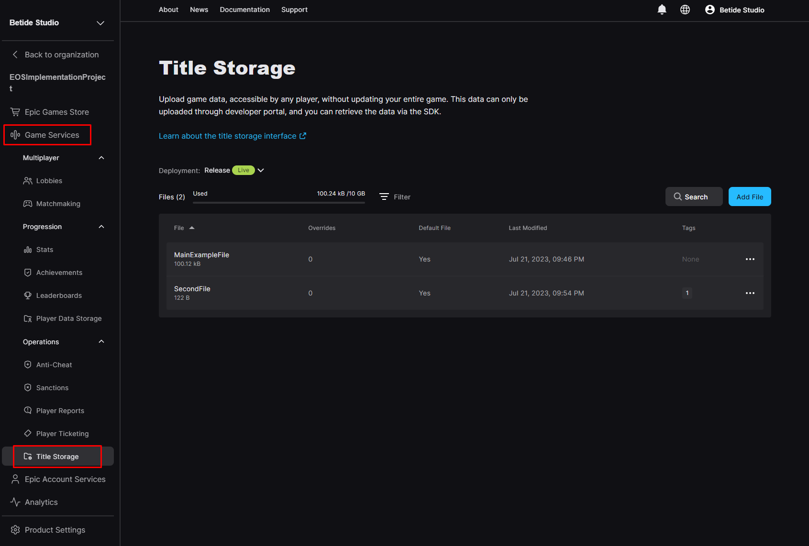
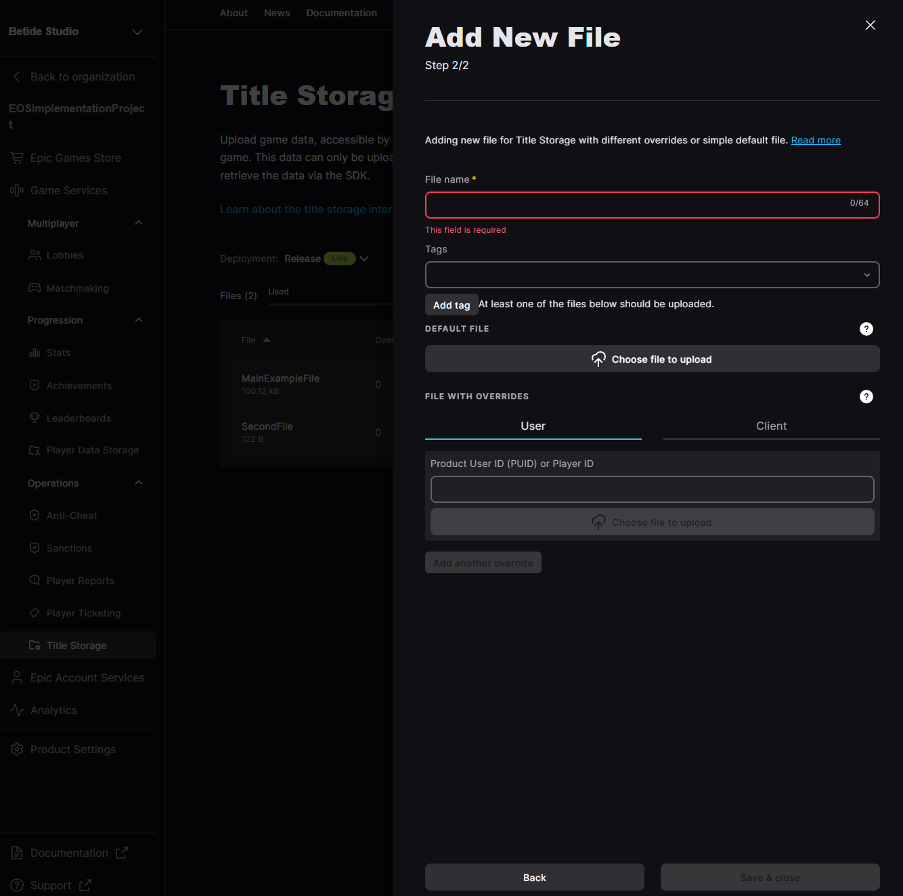

import { Callout } from 'nextra/components'

# Title Storage

Title storage is a system that allows you to store data for a specific title and access it later from any device where the title is installed. This system is useful for storing title settings, configurations, and things like patches etc.

### Upload Title Data

Updating or adding title data cannot be done directly from the game. You will have to use the [EOS Developer Portal](https://dev.epicgames.com/portal) to upload the title data.

1. Go to the [EOS Developer Portal](https://dev.epicgames.com/portal) and log in with your Epic Games account.

2. Click on the **Title Storage** tab on the left side of the screen, under the **Game Services** section.

  

3. Click on the **+ New Title Data** button to create a new title data entry. Now, it will ask you to provide a **Encryption Key** which you can generate using a website like https://numbergenerator.org/random-64-digit-hex-codes-generator.

4. After providing the **Encryption Key**, you can now upload the data you want to store for the title. 

  

### Retrieve Title Data

To retrieve title data, you can use the `Get EIK Title Storage` action. Let's see how we can retrieve the title data we stored earlier:

<iframe src="https://blueprintue.com/render/2kkkf93y/" scrolling="no" allowfullscreen width="100%" height="400px"></iframe>
Cannot view the code? [Click here](https://blueprintue.com/render/2kkkf93y/)