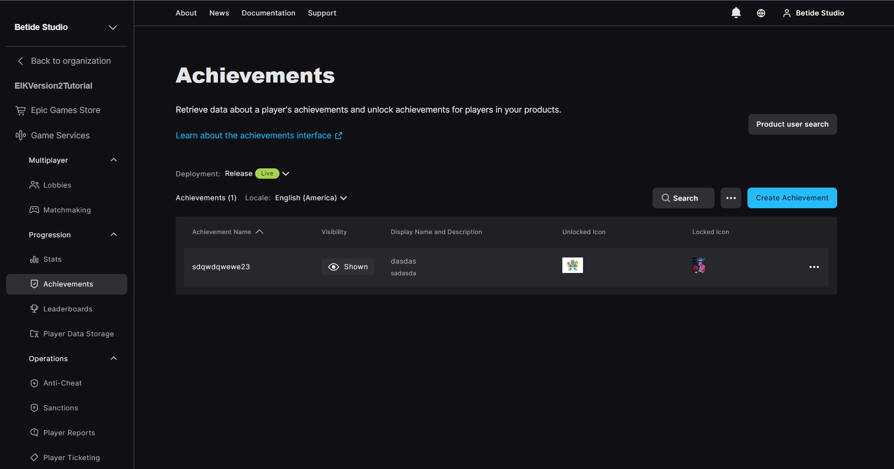
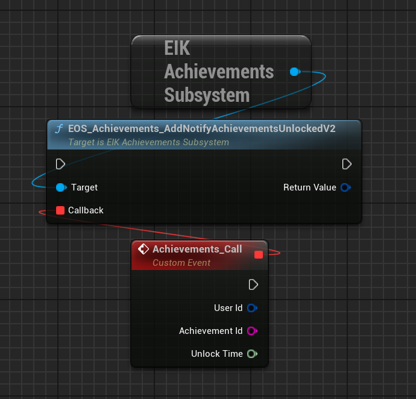
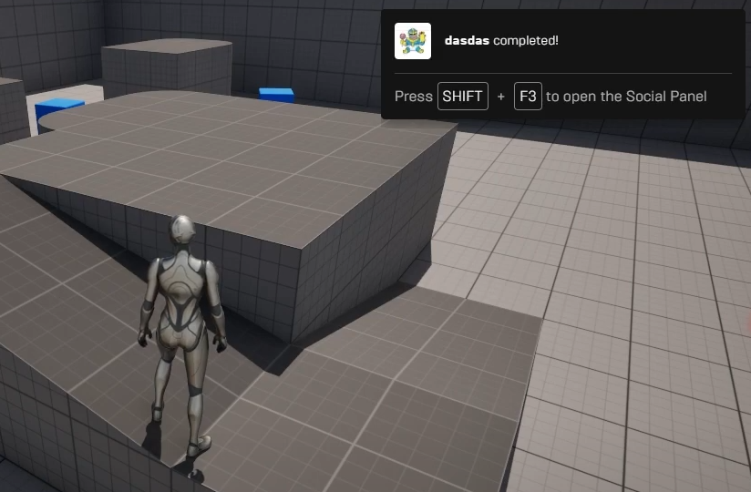

# Achievements 

Achievements are a great way to reward players for completing specific tasks or reaching certain milestones in your game. 

In EOS, achievements are attached to a specific [statistic](/playerinformation/progression/stats) and can be used to reward players for their progress in the game.

## Creating new achievements

1. Go to the [EOS Developer Portal](https://dev.epicgames.com/portal) and log in with your Epic Games account.

2. Click on the **Achievements** tab on the left side of the screen, under the **Game Services** section.

  

3. Click on the **+ New Achievement** button to create a new achievement. Now, it will ask you to select a **Stat Name** and **Stat Value**.

4. After providing the **Stat Name** and **Stat Value**, you can now create the achievement.

Although, you will have to pass additional parameters like **Achievement Name**, **Achievement Description**, **Achievement Icon** etc to create the achievement.

## Updating player achievements

The updates to the achievements are done automatically when you update the statistic value. The achievement will automatically unlock when the player reaches the required value of the statistic.

## Retrieving player achievements

To retrieve the player's achievements, you can use the `Get EIK Achievements` node. This node allows you to get the achievement data for the local player.

<iframe src="https://blueprintue.com/render/j41jh6iw/" scrolling="no" allowfullscreen width="100%" height="400px"></iframe>
Cannot view the code? [Click here](https://blueprintue.com/render/j41jh6iw/)

## Retrieving more information about an achievement

The above function will return the achievement data for the local player which contains the ID of the achievement and it's progress which is not enough to display the achievement in the game.

To get more information about the achievement like the **Achievement Name**, **Achievement Description**, **Achievement Icon** etc, you can use the `Get EIK Achievement Definition` node.

<iframe src="https://blueprintue.com/render/ytnwrl8o/" scrolling="no" allowfullscreen width="100%" height="400px"></iframe>
Cannot view the code? [Click here](https://blueprintue.com/render/ytnwrl8o/)

## Unlocking an achievement

After the player has completed the task or reached the milestone required for the achievement, it will automatically unlock. There is a callback that you can use to check if the achievement has been unlocked + the overlay will also be displayed in the game.

  

  

That is it! You have successfully created, updated, and retrieved achievements for the player in your game.