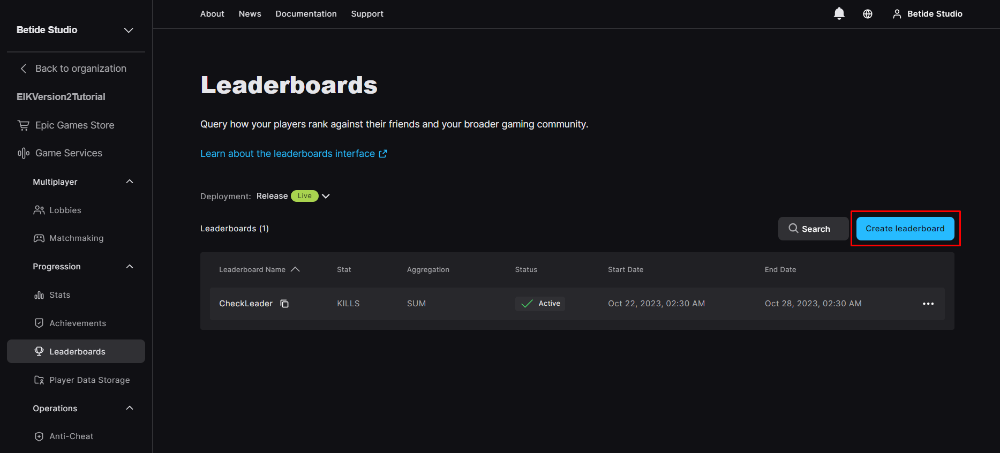
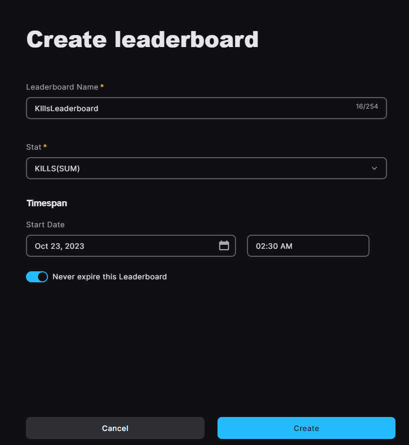

# Leaderboards

Leaderboards are a way to compare your progression with other players. In EOS, leaderboards are attached to a specific [statistic](/playerinformation/progression/stats) and can be used to track the progress of a player in your game.

## Creating new leaderboard

1. Go to the [EOS Developer Portal](https://dev.epicgames.com/portal) and log in with your Epic Games account.

2. Click on the **Leaderboards** tab on the left side of the screen, under the **Game Services** section and then click on the **+ New Leaderboard** button.

  

3. Now, it will ask you to provide a few details like **Leaderboard Name**, **Stat Name**, **Timespan**.

  

Now, the timespan field be made to **Never Expire** if you want the leaderboard to be active forever.

4. After providing the required details, you can now create the leaderboard.

## Updating player leaderboard

The updates to the leaderboard are done automatically when you update the statistic value. The leaderboard will automatically update the player's position based on the statistic value.

## Retrieving player leaderboard

To retrieve the player's leaderboard, you can use the `Get EIK Leaderboard` node. This node allows you to get the leaderboard data for a given rank and range.
 
<iframe src="https://blueprintue.com/render/xzinfj9m/" scrolling="no" allowfullscreen width="100%" height="400px"></iframe>
Cannot view the code? [Click here](https://blueprintue.com/render/xzinfj9m/)