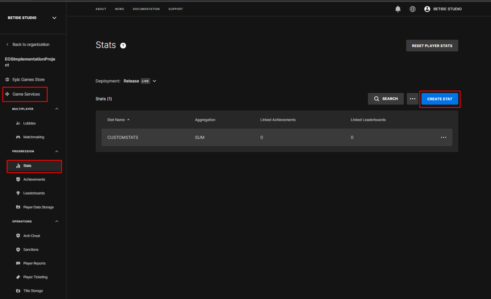
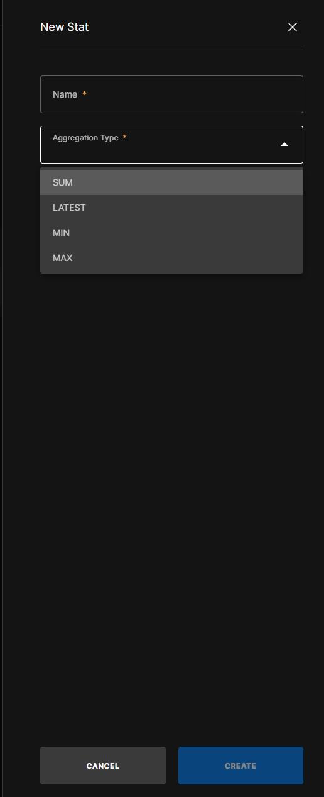

import { Callout } from 'nextra/components'

# Statistics

<Callout type="warning">
    Statistic name should be all **uppercase** and should not contain any spaces or special characters.
 </Callout>

Statistics are a way to track and display the progress of a player in your game. They can be used to show the player's progress in the game, such as the number of kills, deaths, or other information that is relevant to the game.

## Creating new player statistics

1. Go to the [EOS Developer Portal](https://dev.epicgames.com/portal) and log in with your Epic Games account.

2. Click on the **Stats** tab on the left side of the screen, under the **Game Services** section.

  

3. Click on the **+ New Stat** button to create a new statistic. Now, it will ask you to provide a **Stat Name** and **Stat Description**.

- *Sum*: The sum of all the values of the statistic.
- *Latest*: The latest value of the statistic.
- *Max*: The maximum value of the statistic.
- *Min*: The minimum value of the statistic.

  

4. After providing the **Stat Name** and **Stat Description**, you can now create the statistic.

## Updating player statistics

To update a player's statistic, you can use the `Set EIK Stats` node. This node allows you to update the value of a statistic for the local player.
 

<iframe src="https://blueprintue.com/render/1i5d59hn/" scrolling="no" allowfullscreen width="100%" height="400px"></iframe>
Cannot view the code? [Click here](https://blueprintue.com/render/1i5d59hn/)

## Retrieving player statistics

To retrieve a player's statistic, you can use the `Get EIK Stats` node. This node allows you to get the value of a statistic for the local player.

Please note that you can pass a array of statistic names to get multiple statistics at once.

 
<iframe src="https://blueprintue.com/render/d3ige95f/" scrolling="no" allowfullscreen width="100%" height="400px"></iframe>
Cannot view the code? [Click here](https://blueprintue.com/render/d3ige95f/)