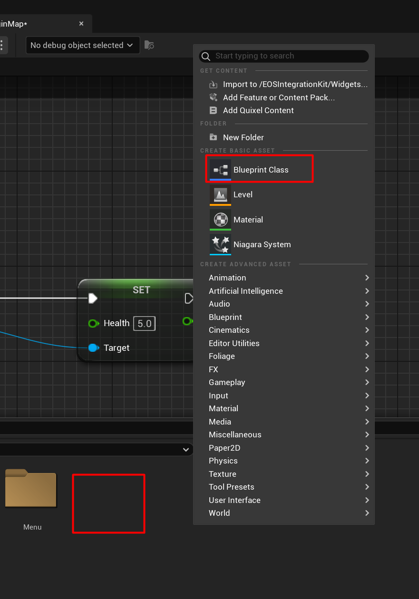
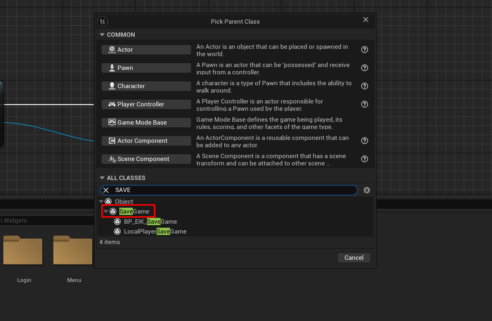
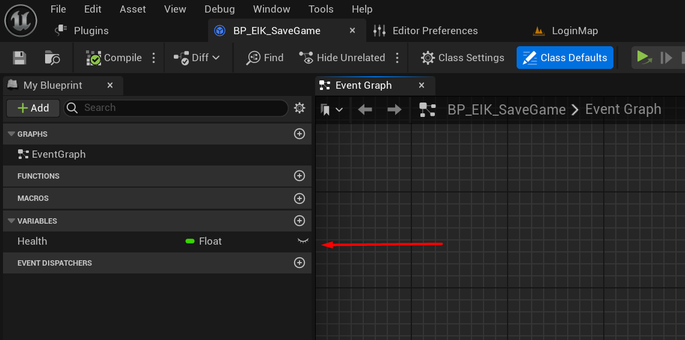
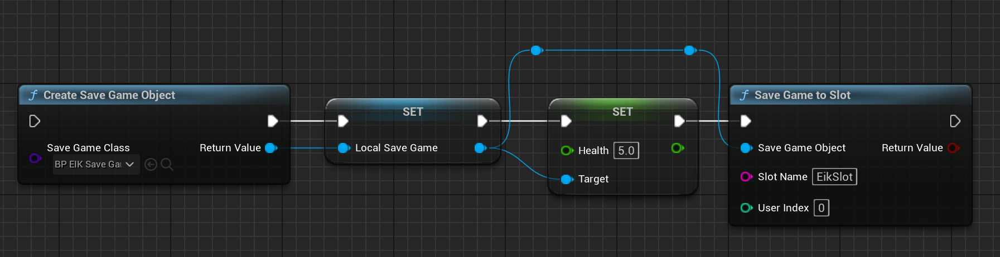
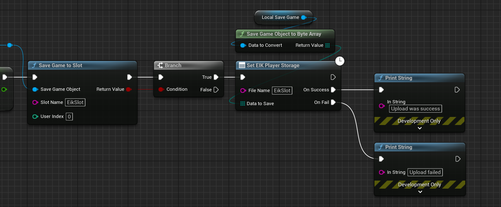
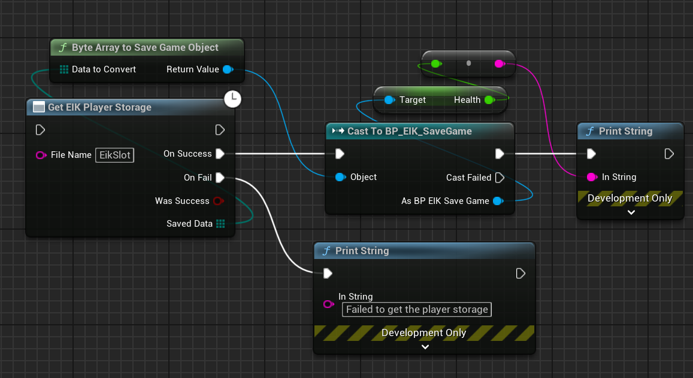

import { Callout } from 'nextra/components'

# Player Data Storage

Player data storage is a system that allows you to store data for a specific player and access it later from any device where the player is logged in. This system is useful for storing player progress, settings, and other data that should be saved between sessions.

### Disadvantages

Player data storage has some limitations and disadvantages that you should be aware of:

- **No Access Control**: Player data storage is only accessible by the player who owns the data. This means that you cannot share data between players or access data from other players.
- **Limited Storage**: The amount of data you can store for a player is limited, as of now, to 400MB per player. Although it seems a lot, but for a lot of game types, it might not be enough.
- **No Data Sharing**: You cannot share data between players using player data storage. If you need to share data between players, you will need to use a different system, such as a database or cloud storage.

## Steps to use Player Data Storage

### Create/Update Player Data

To create or update player data, you can use the `Set EIK Player Storage` action. Let's see how we can store a `SaveGame` object for a player:

#### Create a SaveGame Object

<Callout type="info">
 If you don't know what a `SaveGame` object is, it's a data structure that contains all the information needed to save the game state and restore it later. You can check the below links to learn more about `SaveGame` objects:

    - [Unreal Engine SaveGame Documentation](https://dev.epicgames.com/documentation/en-us/unreal-engine/saving-and-loading-your-game-in-unreal-engine) 
    - [Gorka's SaveGame Tutorial](https://youtu.be/14wmGdbhLOA?si=_Q5IBZrYLXJivXyM)
 </Callout>

Firstly we will create a `SaveGame` object that we want to store for the player. 

To do so, go in **Content Browser** and right-click to create a new Blueprint class. Search for `SaveGame` and create a new `SaveGame` object.

  

  

For the purpose of this tutorial, I am using the already created `BP_EIK_SaveGame` object where the player's health will be stored as an example.

  

Now, we will create a new `BP_EIK_SaveGame` object and set the player's health to 89.

  

#### Store the SaveGame Object

Now that we have created the `SaveGame` object, we can store it for the player using the `Set EIK Player Storage` action.

For this, we will have to convert the `SaveGame` object to a array of bytes. EIK comes with a built-in function to convert the `SaveGame` object to an array of bytes.

  

### Retrieve Player Data

To retrieve player data, you can use the `Get EIK Player Storage` action. Let's see how we can retrieve the `SaveGame` object we stored earlier:

  

As you can see in the above image, we are retrieving the `SaveGame` object and casting it back to the `BP_EIK_SaveGame` object to access the player's health.