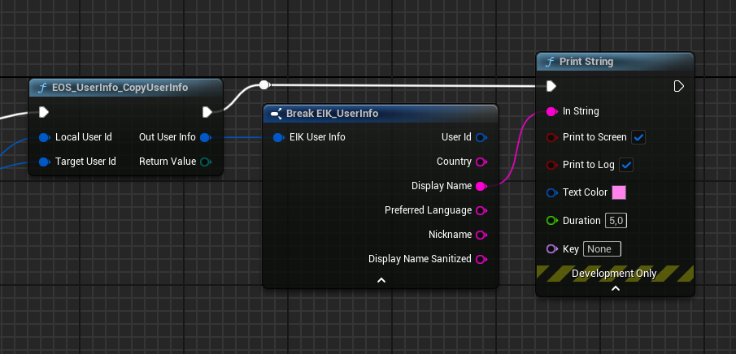

import { Callout } from 'nextra/components'

# Display/Player Names

Retrieving and displaying the Display Name or Player Name is straightforward. This guide will walk you through the process step-by-step.

## Display your own Name

**Setup**: Use the provided API or function to fetch the Display/Player Name associated with your Epic Account ID.
Below is an example of the setup:

**Result**: The output will be the Display/Player Name of the currently logged-in user.
Here's an example of the result:

**Optional**: To integrate the name into your UI, you can assign the fetched name as a String to a Text field in your UI widget. This way, the Display/Player Name will appear in your game's interface or HUD.

## Steps to Display the Name of Another Player

**Setup**: Follow the same steps as above, but replace the Epic Account ID parameter with the Epic Account ID of the target user whose name you want to display.

**Result**: The fetched name will correspond to the provided Epic Account ID. You can then display this name in your UI, similar to the method used for your own name.

## Example Use Cases
- Displaying a teammate's name in a multiplayer lobby.
- Showing an opponent's name during gameplay.
- Populating leaderboards with player names.

## Additional Notes
- Ensure that your code properly handles errors, such as invalid or inaccessible Epic Account IDs.
- If you are using this feature in a multiplayer game, make sure to comply with Epic's privacy policies and guidelines for displaying user information.
- Consider caching the names locally to optimize performance and reduce redundant API calls.